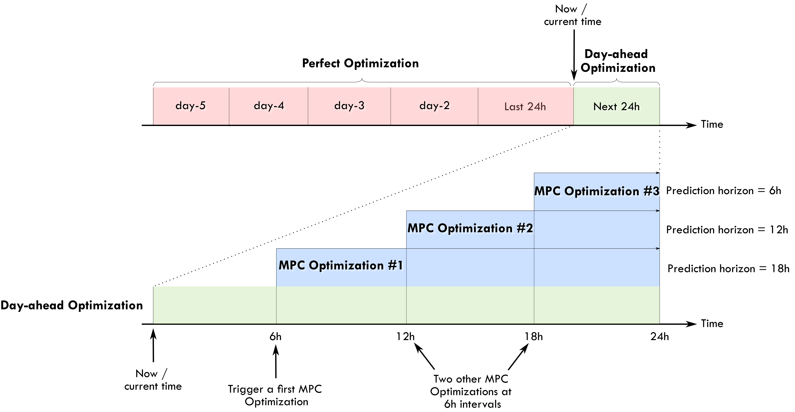
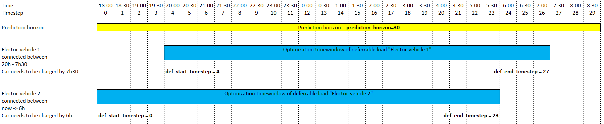
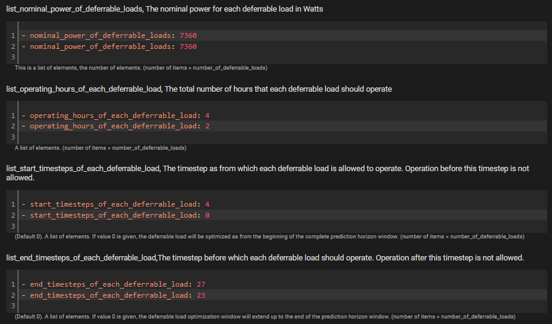
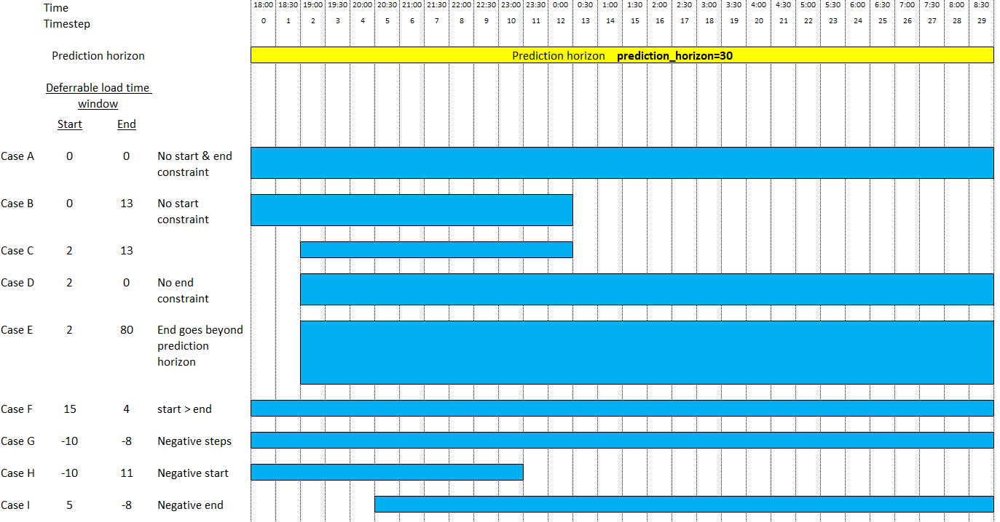

# An EMS based on Linear Programming

In this section, we present the basics of the Linear Programming (LP) approach for a household Energy Management System (EMS).

## Motivation

Home Assistant allows us to monitor solar production, power consumption, and batteries, but managing these devices efficiently is a complex challenge. While basic rules and fixed schedules are simple to implement, they rarely achieve true optimality.

EMHASS (Energy Management for Home Assistant) bridges this gap by implementing a Linear Programming (LP) optimization framework. Instead of relying on static heuristics, EMHASS uses weather and consumption forecasts to automatically schedule controllable loads (such as water heaters, pool pumps, and batteries).

Key highlights:

- Optimization vs. Rules: Real-world testing shows a 5-8% daily economic gain using EMHASS compared to standard rule-based systems.

- Dynamic Decision Making: The system automatically decides whether to run appliances during solar peaks or off-peak tariff hours based on the day's forecast.

- Practical Integration: While inspired by advanced tools like OMEGAlpes, EMHASS focuses on practical implementation, enabling users to deploy academic-grade optimization directly within their Home Assistant environment via configuration files.

## Linear programming

Linear programming is an optimization method that can be used to obtain the best solution from a given cost function using linear modelling of a problem. Typically we can also add linear constraints to the optimization problem.

This can be mathematically written as:

$$
  & \underset{x}{\text{Maximize  }} && \mathbf{c}^\mathrm{T} \mathbf{x}\\
  & \text{subject to  } && A \mathbf{x} \leq \mathbf{b} \\
  & \text{and  } && \mathbf{x} \ge \mathbf{0}
$$

with $\mathbf{x}$  the variable vector that we want to find, $\mathbf{c}$ and $\mathbf{b}$ are vectors with known coefficients and $\mathbf{A}$ is a matrix with known values. Here the cost function is defined by $\mathbf{c}^\mathrm{T} \mathbf{x}$. The inequalities $A \mathbf{x} \leq \mathbf{b}$ and $\mathbf{x} \ge \mathbf{0}$ represent the convex region of feasible solutions. 

We could find a mix of real and integer variables in $\mathbf{x}$, in this case the problem is referred as Mixed Integer Linear Programming (MILP). Typically this kind of problem uses 'branch and bound' type solvers, or similar.

The LP has, of course, its set of advantages and disadvantages. The main advantage is that if the problem is well posed and the region of feasible possible solutions is convex, then a solution is guaranteed and solving times are usually fast when compared to other optimization techniques (such as dynamic programming for example). However we can easily fall into memory issues, larger solving times and convergence problems if the size of the problem is too high (too many equations).

## Household EMS with LP

The LP problem for the household EMS is solved in EMHASS using different user-chosen cost functions.

Three main cost functions are proposed.

### Cost functions

#### 1) The _profit_ cost function

In this case, the cost function is posed to maximize the profit. The profit is defined by the revenues from selling PV power to the grid minus the cost of consumed energy from the grid. 
This can be represented with the following objective function:

$$
\sum_{i=1}^{\Delta_{opt}/\Delta_t} -0.001*\Delta_t*(unit_{LoadCost}[i]*P_{gridPos}[i] + prod_{SellPrice}*P_{gridNeg}[i])
$$

> For the special case of an energy contract where the totality of the PV-produced energy is injected into the grid this will be:

$$
\sum_{i=1}^{\Delta_{opt}/\Delta_t} -0.001*\Delta_t*(unit_{LoadCost}[i]*(P_{load}[i]+P_{defSum}[i]) + prod_{SellPrice}*P_{gridNeg}[i])
$$

where $\Delta_{opt}$ is the total period of optimization in hours, $\Delta_t$ is the optimization time step in hours, $unit_{LoadCost_i}$ is the cost of the energy from the utility in EUR/kWh, $P_{load}$ is the electricity load consumption (positive defined), $P_{defSum}$ is the sum of the deferrable loads defined, $prod_{SellPrice}$ is the price of the energy sold to the utility, $P_{gridNeg}$ is the negative component of the grid power, this is the power exported to the grid. All these power values are expressed in Watts.

#### 2) The energy from the grid _cost_

In this case, the cost function is computed as the cost of the energy coming from the grid. The PV power injected into the grid is not valorized.
This is:

$$
\sum_{i=1}^{\Delta_{opt}/\Delta_t} -0.001*\Delta_t*unit_{LoadCost}[i]*P_{gridPos}[i]
$$

> Again, for the special case of an energy contract where the totality of the PV-produced energy is injected into the grid this will be:

$$
\sum_{i=1}^{\Delta_{opt}/\Delta_t} -0.001*\Delta_t* unit_{LoadCost}[i]*(P_{load}[i]+P_{defSum}[i])
$$

#### 3) The _self-consumption_ cost function

This is a cost function designed to maximize the self-consumption of the PV plant. 
```{note}
EMHASS has two methods for defining a self-consumption cost function: **bigm** and **maxmin**. In the current version, only the **bigm** method is used, as the maxmin method has convergence issues.
```

##### bigM self-consumption method
In this case, the cost function is based on the profit cost function, but the energy offtake cost is weighted more heavily than the energy injection revenue. 
This can be represented with the following objective function:

$$
\sum_{i=1}^{\Delta_{opt}/\Delta_t} -0.001*\Delta_t*(bigM*unit_{LoadCost}[i]*P_{gridPos}[i] + prod_{SellPrice}*P_{gridNeg}[i])
$$

where bigM equals 1000.
Adding this bigM factor will give more weight to the cost of grid offtake, or formulated differently: avoiding offtake through self-consumption will have a strong influence on the calculated cost.

Please note that the bigM factor is not used in the calculated cost that comes out of the optimizer results. It is only used to drive the optimizer.

> ##### **Maxmin self-consumption method** (currently disabled)
>
> The cost function is computed as the revenues from selling PV power to the grid, plus the avoided cost of consuming PV power locally (the latter means: valorizing the self-consumed cost at the grid offtake price).
>
> The self-consumption is defined as:
> 
> $$
> SC = \min(P_{PV}, (P_{load}+P_{defSum}))
> $$
> 
> To convert this to a linear cost function, an additional continuous variable $SC$ is added. This is the so-called maximin problem.
> The cost function is defined as:
> 
> $$
> \sum_{i=1}^{\Delta_{opt}/\Delta_t} SC[i]
> $$
> 
> With the following set of constraints:
> 
> $$
> SC[i] \leq P_{PV}[i]
> $$
> 
> and
> 
> $$
> SC[i] \leq P_{load}[i]+P_{defSum}[i]
> $$

All these cost functions can be chosen by the user with the `--costfun` tag with the `emhass` command. The options are: `profit`, `cost`, and `self-consumption`.
They are all set in the LP formulation as cost a function to maximize.

The problem constraints are written as follows.

### The main constraint: power balance

$$
P_{PV_i}-P_{defSum_i}-P_{load_i}+P_{gridNeg_i}+P_{gridPos_i}+P_{stoPos_i}+P_{stoNeg_i}=0
$$

with $P_{PV}$ the PV power production, $P_{gridPos}$ the positive component of the grid power (from the grid to household), $P_{stoPos}$ and $P_{stoNeg}$ are the positive (discharge) and negative components of the battery power (charge).

Normally the PV power production and the electricity load consumption are considered known. In the case of a day-ahead optimization, these should be forecasted values. When the optimization problem is solved the others power defining the power flow are found as a result: the deferrable load power, the grid power and the battery power.

### Other constraints

Some other special linear constraints are defined. A constraint is introduced to avoid injecting and consuming from the grid at the same time, which is physically impossible. Other constraints are used to control the total time that a deferrable load will stay on and the number of start-ups. 

Constraints are also used to define semi-continuous variables. Semi-continuous variables are variables that must take a value between their minimum and maximum or zero.

A final set of constraints is used to define the behavior of the battery. Notably:
- Ensure that maximum charge and discharge powers are not exceeded.
- Minimum and maximum state of charge values are not exceeded.
- Force the final state of charge value to be equal to the initial state of charge.

The minimum and maximum state of charge limitations can be expressed as follows:

$$
\sum_{i=1}^{k} \frac{P_{stoPos_i}}{\eta_{dis}} + \eta_{ch}P_{stoNeg_i} \leq \frac{E_{nom}}{\Delta_t}(SOC_{init}-SOC_{min})
$$

and

$$
-(\sum_{i=1}^{k} \frac{P_{stoPos_i}}{\eta_{dis}} + \eta_{ch}P_{stoNeg_i}) \leq \frac{E_{nom}}{\Delta_t}(SOC_{max}-SOC_{init})
$$

where $E_{nom}$ is the battery capacity in kWh, $\eta_{dis/ch}$ are the discharge and charge efficiencies and $SOC$ is the state of charge.

Forcing the final state of charge value to be equal to the initial state of charge can be expressed as follows:

$$
\sum_{i=1}^{k} \frac{P_{stoPos_i}}{\eta_{dis}} + \eta_{ch}P_{stoNeg_i} = \frac{E_{nom}}{\Delta_t}(SOC_{init}-SOC_{final})
$$

### Hybrid inverter conversion

With `inverter_is_hybrid` set to true, PV and all batteries sit on one DC bus behind a single hybrid inverter, and the power balance above is written on the AC side with the inverter power $P_{hybrid}$ in place of the PV and battery terms:

$$
P_{hybrid_i}-P_{defSum_i}-P_{load_i}+P_{gridNeg_i}+P_{gridPos_i}=0
$$

$P_{hybrid}$ is positive when the inverter delivers AC power and negative when it draws AC power to charge the batteries. It is tied to the DC bus through two non-negative inverter flows, $P_{dcac}$ (DC bus to AC) and $P_{acdc}$ (AC to DC bus). With $P_{stoPos}$ and $P_{stoNeg}$ summed over all batteries and $P_{curt}$ the optional PV curtailment, the DC bus balance is

$$
P_{PV_i}-P_{curt_i}+P_{stoPos_i}+P_{stoNeg_i}=P_{dcac_i}-P_{acdc_i}
$$

and a direction binary $\delta_i$ (1 when the DC bus feeds AC) keeps the two flows from being active together:

$$
P_{dcac_i}\le \delta_i\,\bar P_{dcac}\qquad P_{acdc_i}\le (1-\delta_i)\,\bar P_{acdc}
$$

**Legacy conversion (default).** Each direction has a scalar efficiency, `inverter_efficiency_dc_ac` $=\eta_{dcac}$ and `inverter_efficiency_ac_dc` $=\eta_{acdc}$:

$$
P_{hybrid_i}=\eta_{dcac}\,P_{dcac_i}-\frac{P_{acdc_i}}{\eta_{acdc}}
$$

**Optional piecewise-linear conversion.** When `inverter_power_curve_dc_ac` and/or `inverter_power_curve_ac_dc` is set, the scalar term of that direction is replaced by an exact piecewise-linear transfer between the **AC-side** power and the DC-bus flow it implies. The public points are indexed on the AC side, where inverters are commanded and measured: `[ac_output_power_w, efficiency]` for DC to AC and `[ac_input_power_w, efficiency]` for AC to DC. Writing $A_{out}$ and $A_{in}$ for the non-negative AC output and input powers,

$$
P_{hybrid_i}=A_{out_i}-A_{in_i}\qquad P_{dcac_i}=f_{dcac}(A_{out_i})\qquad P_{acdc_i}=g_{acdc}(A_{in_i})
$$

(a direction without a curve keeps $A_{out}=\eta_{dcac}P_{dcac}$ or $A_{in}=P_{acdc}/\eta_{acdc}$). Each configured point $(a_k,\eta_k)$ is first converted to a power-transfer breakpoint $(a_k,d_k)$ with $d_k=a_k/\eta_k$ (DC to AC, so $\eta_k>0$: positive AC output always needs DC input) or $d_k=\eta_k a_k$ (AC to DC, so $\eta_k=0$ is allowed and gives $d_k=0$), and the transfer origin $(a_0,d_0)=(0,0)$ is added internally because efficiency at zero power is undefined. The DC-side breakpoints must not decrease; a flat segment, such as a measured 0 % charge efficiency at 50 W (50 W AC in gives 0 W DC out), is valid and is solved exactly. Because the independent coordinate is the AC power, a flat segment is an ordinary function of it: there is no vertical segment and no non-function geometry. The conversion happens once, on the breakpoints: between them the *power transfer* is interpolated linearly, never the efficiency (which would make $P\,\eta(P)$ quadratic). A direction without a curve keeps its scalar term, so the two directions can be mixed. For a curve with breakpoints $(a_0,d_0),\dots,(a_K,d_K)$ ($K$ configured points), segment $k$ has width $w_k=a_k-a_{k-1}$ and slope $s_k=(d_k-d_{k-1})/w_k$. With one fill fraction $u_k\in[0,1]$ per segment and $K-1$ binaries $b_k$,

$$
A=\sum_{k=1}^{K} w_k u_k \qquad P_{dc}=\sum_{k=1}^{K} s_k w_k u_k \qquad u_{k+1}\le b_k\le u_k \qquad u_1\le\delta
$$

(for the AC-to-DC curve, $u_1\le 1-\delta$). The ordering constraints force segments to fill in sequence, so $P_{dc}$ is exactly $f(A)$ at every time step whether or not the curve is convex, and no separate on/off binary is needed because the existing direction binary $\delta$ gates the first segment. $A$ is an expression of the fill fractions, not a free variable, so every watt of AC power is accounted for. The last breakpoint $a_K$ is the supported power limit. For a curved direction the bounds $\bar P_{dcac}$ and $\bar P_{acdc}$ above are replaced by the AC-side limits `inverter_ac_output_max` and `inverter_ac_input_max` applied to $A_{out}$ and $A_{in}$, and the scalar efficiency of that direction is not used at all.

The relation is an equality on purpose. A one-sided form such as $P_{dc}\le g(A)$ or $A\ge g^{-1}(P_{dc})$ (a convex-hull "epigraph" relaxation) would let the optimizer draw more AC power than the DC power it delivers; when the import price is negative that surplus is paid for, so the solver would import AC power for money and dissipate it. The equality leaves no such freedom: every watt drawn from AC either reaches the DC bus as the curve says or is not drawn. This is different from a user-declared dead zone. If the curve says 50 W AC in gives 0 W DC out and the import price is negative enough, the optimizer may rationally draw those 50 W and lose them as inverter heat: that is physically real given the supplied curve, it is accounted for, and EMHASS deliberately does not suppress it with a minimum-power rule (there is no minimum charge or discharge power setting in EMHASS).

The curves describe only the inverter stage between the DC bus and AC. $P_{stoPos}$, $P_{stoNeg}$ and the published `P_batt` are DC-bus (battery-side) powers, while $P_{hybrid}$ is the AC-side power. The battery state of charge equations above are unchanged: they still use $\eta_{dis}$ and $\eta_{ch}$ (`battery_discharge_efficiency` and `battery_charge_efficiency`), which are the batteries' own efficiencies and are never replaced by an inverter curve. Likewise `battery_charge_power_derating` still bounds $P_{stoNeg}$ as a power ceiling. Standby consumption is not part of either curve ($f(0)=g(0)=0$), and with several batteries the single inverter acts on their combined DC power.

### Inverter Stress Cost (Smooth Operation)

There is the ability to apply a "Stress Cost" to your Hybrid Inverter. This feature adds a virtual cost to high-power operation, encouraging the system to run "low and slow" rather than jumping between 0% and 100% power for marginal gains.

Standard linear optimization often results in "bang-bang" control: the battery charges at maximum speed as soon as energy is cheap, and discharges at maximum speed as soon as it is profitable.

While mathematically optimal for profit, this can have downsides in the real world:

- Thermal Stress: Running at 100% generates significant heat.
- Fan Noise: High load triggers loud cooling fans.
- Efficiency Losses: Resistive losses ($I^2R$) increase quadratically with power.
- Battery Health: High C-rates can degrade battery chemistry faster.

The Inverter Stress Cost introduces a penalty that increases quadratically with power usage. The optimizer will now balance the "profit" from energy arbitrage against this "stress" penalty, preferring to spread the load over a longer time window if the price difference isn't massive.

The cost is modeled as a symmetric quadratic function of the inverter power ($Cost \propto Power^2$). Because EMHASS uses Linear Programming (LP), this quadratic curve is approximated using a Piecewise Linear function.

The penalty is calculated such that at Nominal Power (100% load), the stress cost equals your configured `inverter_stress_cost`.

- Low Power: Very low penalty.
- High Power: High penalty.

$$\text{Total Cost} = \text{Energy Cost} + \text{Stress Penalty}(P_{inverter})$$

To enable this, add the following parameters to your `config.json` (or `optim_conf` in `config_emhass.yaml`):

- `inverter_stress_cost` (float): The virtual penalty cost (in currency/kWh) applied if the inverter runs at its maximum nominal power (Recommended: 0.05 - 0.20).
- `inverter_stress_segments` (Integer): The number of linear segments used to approximate the quadratic curve. Higher values are more accurate but increase computation slightly (Recommended: 10).

Example usage using `runtimeparams`:
```bash
curl -i -H "Content-Type: application/json" -X POST -d '{
    "inverter_stress_cost": 0.5,
    "prediction_horizon": 24
}' http://localhost:5000/action/naive-mpc-optim
```

### Battery SOC Surplus Cost (high-SOC dwell penalty)

Standard cost optimization will charge the battery to 100% as soon as there is cheap or surplus energy, then leave it sitting full for hours. On a flat tariff there is no price signal to stop it. Sitting at a high state of charge for long periods accelerates calendar aging, and on sunny days it means the battery fills early and exports the rest of the midday peak to the grid instead of soaking it up gradually.

The SOC surplus cost adds a virtual penalty for every kWh the battery sits above a configured threshold, for every hour it stays there. The optimizer balances that penalty against the value of charging early, so it tends to delay and slow charging into the expected solar peak and spend less time near full charge. It is the mirror of the existing SOC deficit cost, which penalizes sitting below a low threshold.

Two parameters control it (both default to off):

- `battery_soc_surplus_threshold` (float): the SOC above which the penalty applies, for example `0.90` for 90%.
- `battery_soc_surplus_cost` (float): the virtual cost in currency/kWh/h applied for each kWh above the threshold per hour. The default of `0.0` leaves today's behaviour unchanged.

The penalty is linear in the energy held above the threshold:

$$\text{Surplus penalty} = \sum_{i} c_{surplus} \cdot \Delta_t \cdot \max\left(0,\; (SOC_i - SOC_{thr})\,E_{nom}\right)$$

where $c_{surplus}$ is `battery_soc_surplus_cost`, $SOC_{thr}$ is `battery_soc_surplus_threshold` and $E_{nom}$ is the battery capacity.

Example usage using `runtimeparams`:
```bash
curl -i -H "Content-Type: application/json" -X POST -d '{
    "battery_soc_surplus_threshold": 0.85,
    "battery_soc_surplus_cost": 0.1,
    "prediction_horizon": 24
}' http://localhost:5000/action/naive-mpc-optim
```

## Thermal storage and heat pumps

EMHASS optimizes heat alongside electricity. A thermal store - a hot-water tank, a
space-heating buffer, a pool, or the thermal mass of the house - is modelled as a
**temperature state** the optimizer steers through the horizon, the thermal
equivalent of a battery's state of charge. This section describes how those stores
enter the linear program, how non-electric sources are priced, and how the
temperature-dependent COP of a heat pump - which breaks linearity - is handled by a
dynamic-programming refinement.

For the user-facing configuration of these features see the
[Thermal Integration](section_thermal.md) section.

### Thermal store dynamics

Each store carries a temperature $T[i]$ that evolves by a first-order energy
balance:

$$
T[i+1] = T[i] + \frac{\Delta_t}{C}\Big(Q_{in}[i] + Q_{xfer}[i] - D[i] - L[i]\Big)
$$

where $C$ is the store's heat capacity in kWh/K (from a water `volume` or a
building `thermal_mass`), $Q_{in}$ is the heat delivered by its sources, $Q_{xfer}$
the net heat exchanged with other stores, $D$ the demand drawn from it (hot-water
draw-off and/or building heat loss), and $L$ the standing loss, all as average
powers in kW over the step. The loss is either a flat hot-water standing loss or,
for a building zone, a **state-dependent** term
$L[i] = UA\,(T[i]-T_{out}[i])$ - so a warmer zone loses faster, which is
what lets the optimizer pre-heat the mass on cheap power and coast through a peak.

The heat a source contributes depends on its type. An electric resistive element
delivers $Q = \eta\,P_{elec}$; a gas or oil boiler delivers $Q = \eta\,P_{input}$; a
heat pump delivers $Q = \text{COP}\cdot P_{elec}$.

**Comfort bounds.** Each store has hard per-step minimum and maximum temperatures,
and an optional soft `desired_temperature` band whose shortfall is priced as a
penalty (so the optimizer pulls toward comfort when it is cheap, without rendering
the problem infeasible when it is not). Index 0 is pinned to the live measured
temperature, so every re-plan starts from the real sensor value.

**Start-temperature recovery.** If the live temperature starts *below* a floor
that applies within the first 6 steps (a momentary out-of-band reading on a cold
morning), demanding that floor from the next step could be infeasible - a high-mass
store cannot jump back into band in one step. For that run EMHASS prices every
degree below the configured floors instead of holding them hard, with a weight that
dominates energy prices, so a store recovers as fast as its sources allow, then
holds the floor, and never makes the problem infeasible. A floor that only rises
later in the horizon does not trigger this, because the plan can heat ahead for it.

**Tank-to-tank transfers.** A store can feed another through an emitter conductance
(for example a buffer supplying a room or a pool). The transferred heat is a
decision bounded by $Q_{xfer} \le k\,(T_{from}-T_{to})$ and by a maximum delivered
power (and is zero when the receiver is as warm or warmer), and leaves
the source store while entering the sink store in the same balance.

### Non-electric sources and the capacity tariff

A gas boiler, oil burner, or district-heat source produces heat without drawing
electricity. Such a source is flagged `is_electric_load = False`: its power is kept
**out of the electrical power balance** $P_{defSum}$, so firing the boiler creates no
phantom grid draw, and it is priced directly at its own commodity tariff (via its
`cost_track`) rather than the retail electricity price:

$$
\text{cost}_{k} = \sum_i \Delta_t \cdot c_k[i]\cdot P_{k}[i] \qquad (\text{non-electric load } k)
$$

For an electric load the per-load cost is instead applied as an *adjustment*
$\big(c_k[i]-unit_{LoadCost}[i]\big)P_k[i]$ on top of the shared tariff, so a load
with its own price ends up charged at exactly that price. Because non-electric
sources never enter the grid-import term, they are also **excluded from the
capacity (peak-power) tariff** - only electrical import counts toward the billed
peak.

### The temperature-dependent COP and why it is non-convex

A heat pump's coefficient of performance falls as it has to push the store hotter.
EMHASS uses a Carnot-fraction model:

$$
\text{COP}(T) = \eta_{Carnot}\cdot\frac{T_{supply}+273.15}{T_{supply}-T_{out}},
\qquad T_{supply}=T+\delta_{approach}
$$

clipped to a physical range (default $[1, 8]$), where $\delta_{approach}$ is the
heat-exchanger approach between the store and the condenser. The delivered heat is
then

$$
Q = \text{COP}(T)\cdot P_{elec}
$$

a **bilinear product** of the (chosen) temperature and the electric power - a
non-convex coupling a single linear program cannot represent. The MILP therefore
plans against a COP *linearized at an assumed temperature*. That is fine as long as
the store ends up near that temperature, but if super-heating is profitable - for
instance to bank surplus PV into the buffer - the MILP would happily super-heat at
the optimistic assumed COP, even though the real condenser must run hotter and the
true COP is lower.

### Dynamic-programming COP refinement

To recover the true optimum without abandoning the fast LP, EMHASS adds a post-solve
**dynamic-programming (DP) refinement**:

1. **Consistency check (auto-trigger).** For each heat-pump store, compare the COP
   the solve *used* against $\text{COP}(T)$ evaluated at the temperature the solve
   actually *reached*. If they agree within a tolerance the plan is already
   self-consistent and nothing happens - the DP is a no-op exactly when it is not
   needed. It engages only when the discrepancy exceeds the tolerance.
2. **Exact DP.** When engaged, EMHASS discretizes the store temperature into a grid
   and solves the store's trajectory by backward induction, evaluating the *true*
   COP at every state. Dynamic programming handles the non-convexity directly: no
   linearization, and a single backward pass yields the optimal temperature schedule
   and heat-pump/backup dispatch on that temperature grid (the coupled store's state
   is interpolated).
3. **Coupled store.** A buffer that feeds a larger banking store (such as a pool)
   can be refined *jointly* - a second state in the DP - so the decision to
   super-heat accounts for what the coupled store can absorb. The coupled grid is
   bounded to keep the state space tractable.
4. **Re-solve.** The DP's COP for each step, and a ceiling 1 degree above the
   DP's peak (a floor 1 degree below its trough when cooling), are fed back as a
   corrected parameter and an extra constraint, and the problem is solved once
   more, as a new problem with half of the solver's time limit (at least 10 s).
   The ceiling is not per step: the DP models a store fed through a
   gradient-limited transfer (such as a house) only as a fixed demand, and a
   per-step ceiling at the DP's trajectory would keep the feeding tank too cold
   to serve it. The trade-off is that a step the re-solve takes hotter than the
   DP priced keeps a COP that is optimistic there.

If the re-solve fails, times out or is infeasible (for example when demand outruns
the DP's estimate), the original plan is kept. If the DP finds no feasible
trajectory, the store is capped at the temperature its static COP is valid for
(each step's curve supply minus the approach) and re-solved. The DP prices the
store's own `desired_temperature` shortfall as the solve does (`penalty_factor` per
degree); a coupled store's target is left to the re-solve. Above a heat pump's
`max_supply_temperature` only the backup source adds heat in the DP, as in the
solve. The DP uses one minimum and maximum temperature for the whole horizon
and ignores the store's `thermal_inertia`; the re-solve still enforces the bounds
and the lag. The DP optimizes a simplified model of the tank (a coupled store at most, other
receivers as a fixed demand), so on a system with several coupled stores the
refined plan is not always cheaper than the static one. In a hybrid example (heat
pump and gas boiler, DHW tank, buffer feeding a pool and a house), re-costing each
plan with the COP at the temperatures it reaches gave 5.12 for `static` and 5.55
for `auto`; try both on your own system before switching. The DP itself is not
bound by the solver
time limit. Measured on x86 over 96 steps: about 14 s for a buffer with a coupled
pool at the default grid, and about 60 s with the tank grid at its 200-state cap
(the coupled grid is capped at 64 states); slower hardware takes longer.

**Cooling.** For a `cool` store fed by a heat pump with a `cooling_curve`, the DP runs
in cooling mode: the unit removes heat, the evaporator runs below the store
temperature, and the COP is priced on the lift from the evaporator to outdoor. A
cool store coupled to a second store is not refined and keeps its static COP.

**Marginal price - super-heating into PV.** The DP is driven not by the raw import
tariff but by the **marginal** cost of running the heat pump at each step. Where the
system is importing, that is the import tariff; where PV is in surplus and the system
is exporting, running the heat pump instead *forgoes the export revenue*, so its true
marginal cost is the (lower) export price:

$$
p_{marg}[i] = \begin{cases}
prod_{SellPrice}[i] & \text{if exporting (PV surplus)}\\
unit_{LoadCost}[i] & \text{otherwise}
\end{cases}
$$

Feeding this to the DP is what makes it super-heat the store into otherwise-exported
solar rather than only chasing the cheapest tariff hour.

**Per-step COP.** The COP grid the DP optimizes against is two-dimensional,
$\text{COP}[i, T]$, indexed by both the timestep and the store temperature, so the
intraday swing in outdoor temperature - a cold dawn, a mild PV-rich midday - is
reflected in the true COP at each hour instead of being averaged away.

### The `cop_solver` setting

The refinement is controlled by three `optim_conf` options:

- `cop_solver` (`auto` | `dp` | `static`): `static` (the default) disables the
  refinement and keeps the pure-LP plan; `auto` runs the consistency check and engages
  the DP only when the static COP is inconsistent; `dp` always runs it.
- `cop_solver_tolerance` (float, in COP units): how large a COP discrepancy
  (the max absolute difference between the COP the solve used and the COP at the
  temperature it achieved) `auto` tolerates before engaging the DP.
- `cop_hx_approach` (degrees Celsius, default `5`): the heat-exchanger approach
  $\delta_{approach}$ between the store and the heat pump's working fluid used when
  evaluating $\text{COP}(T)$ - the condenser runs at store temperature plus this
  value when heating, the evaporator at store temperature minus it when cooling.

## Solver tractability: the MIP gap on long or complex problems

A MILP solver does two things: it *finds* a good integer solution, and then it
*proves* that solution is optimal by closing the gap between the best solution and
the best theoretical bound. `lp_solver_mip_rel_gap` sets how close the proof has to
get: the default `0.01` stops once the plan is provably within 1% of optimal, and `0`
demands a proof of exact optimality - which is the expensive part. The number of binary variables (mutual-exclusion groups, the
`max_supply_temperature` cap gates, semi-continuous and single-constant loads)
grows with the horizon, so the branch-and-bound search can explode on a long
horizon or a rich [heat topology](heat_topology.md).

Concretely: a 48-hour (96-step) day-ahead optimization of a hybrid system with
several tanks and mutual-exclusion groups can fail to solve within any practical
`lp_solver_timeout` at a tight gap: the solve times out and EMHASS falls back to the
relaxed plan (`Optimal (Relaxed)`, without the on/off constraints), because the
solver keeps trying to *prove* optimality long after it has *found* the optimum.
Loosening `lp_solver_mip_rel_gap` a little (e.g. from the default `0.01` to `0.02`)
tells it to stop once the solution is provably within 2% of optimal - which can
collapse the same problem to a few seconds. In practice the quality cost is negligible (the returned plan is
typically the true optimum; only the *certificate* is relaxed). Reach for this lever
whenever a long horizon, many deferrable loads, or a complex topology makes the
solve time-out; a 24-hour horizon usually solves fast enough at the default. See
`lp_solver_mip_rel_gap` in [the configuration reference](config.md).

## The EMHASS optimizations

There are 3 different optimization types that are implemented in EMHASS.

- A perfect forecast optimization.

- A day-ahead optimization.

- A Model Predictive Control optimization.

The following example diagram may help us understand the time frames of these optimizations:



### Perfect forecast optimization

This is the first type of optimization task that is proposed with this package. In this case, the main inputs, the PV power production and the house power consumption are fixed using historical values from the past. This means that in some way we are optimizing a system with a perfect knowledge of the future. This optimization is of course non-practical in real life. However, this can give us the best possible solution to the optimization problem that can be later used as a reference for comparison purposes. In the example diagram presented before, the perfect optimization is defined on a 5-day period. These historical values will be retrieved from the Home Assistant database.

### Day-ahead optimization

In this second type of optimization task, the PV power production and the house power consumption are forecasted values. This is the action that should be performed in a real case scenario and is the case that should be launched from Home Assistant to obtain an optimized energy management plan for future actions. This optimization is defined in the time frame of the next 24 hours.

As the optimization is bounded to forecasted values, it will also be bounded to uncertainty. The quality and accuracy of the optimization results will be inevitably linked to the quality of the forecast used for these values. The better the forecast error, the better the accuracy of the optimization result.

### Model Predictive Control (MPC) optimization

An MPC controller was introduced in v0.3.0. This is an informal/naive representation of a MPC controller. 

This type of controller performs the following actions:

- Set the prediction horizon: a fixed value for a receding horizon or a variable value for a shrinking horizon approach.
- Perform an optimization on the prediction horizon.
- Apply the first element of the obtained optimized control variables.
- Repeat at a relatively high frequency, ex: 5 min.

In the example diagram presented before, the MPC is performed at 6h intervals at 6h, 12h and 18h. The prediction horizon is progressively reduced during the day to keep the one-day energy optimization notion (it should not just be a fixed rolling window as, for example, you would like to know when you want to reach the desired `soc_final`). This type of optimization is used to take advantage of actualized forecast values during throughout the day. The user can of course choose higher/lower implementation intervals, keeping in mind the constraints below on the `prediction_horizon`.

When applying this controller, the following `runtimeparams` should be defined:

- `prediction_horizon` for the MPC prediction horizon. Fix this at least 5 times the optimization time step.

- `soc_init` for the initial value of the battery SOC for the current iteration of the MPC. 

- `soc_final` for the final value of the battery SOC for the current iteration of the MPC. 

- `operating_hours_of_each_deferrable_load` for the list of deferrable loads functioning hours. These values can decrease as the day advances to take into account the shrinking horizon daily energy objectives for each deferrable load.

- `start_timesteps_of_each_deferrable_load` for the timestep as from which each deferrable load is allowed to operate (if you don't want the deferrable load to use the whole optimization timewindow). If you specify a value of 0 (or negative), the deferrable load will be optimized as from the beginning of the complete prediction horizon window.

- `end_timesteps_of_each_deferrable_load` for the timestep before which each deferrable load should operate (if you don't want the deferrable load to use the whole optimization timewindow). If you specify a value of 0 (or negative), the deferrable load will be optimized over the complete prediction horizon window.

In a practical use case, the values for `soc_init` and `soc_final` for each MPC optimization can be taken from the initial day-ahead optimization performed at the beginning of each day.

A correct call for an MPC optimization should look like this:

```bash
curl -i -H 'Content-Type:application/json' -X POST -d '{"pv_power_forecast":[0, 70, 141.22, 246.18, 513.5, 753.27, 1049.89, 1797.93, 1697.3, 3078.93], "prediction_horizon":10, "soc_init":0.5,"soc_final":0.6}' http://192.168.3.159:5000/action/naive-mpc-optim
```
*Example with :`operating_hours_of_each_deferrable_load`, `start_timesteps_of_each_deferrable_load`, `end_timesteps_of_each_deferrable_load`.*
```bash
curl -i -H 'Content-Type:application/json' -X POST -d '{"pv_power_forecast":[0, 70, 141.22, 246.18, 513.5, 753.27, 1049.89, 1797.93, 1697.3, 3078.93], "prediction_horizon":10, "soc_init":0.5,"soc_final":0.6,"operating_hours_of_each_deferrable_load":[1,3],"start_timesteps_of_each_deferrable_load":[0,3],"end_timesteps_of_each_deferrable_load":[0,6]}' http://localhost:5000/action/naive-mpc-optim
```

For a more readable option we can use the `rest_command` integration:
```yaml
rest_command:
  url: http://127.0.0.1:5000/action/naive-mpc-optim
  method: POST
  headers:
    content-type: application/json
  payload: >-
    {
      "pv_power_forecast": [0, 70, 141.22, 246.18, 513.5, 753.27, 1049.89, 1797.93, 1697.3, 3078.93],
      "prediction_horizon":10,
      "soc_init":0.5,
      "soc_final":0.6,
      "operating_hours_of_each_deferrable_load":[1,3],
      "start_timesteps_of_each_deferrable_load":[0,3],
      "end_timesteps_of_each_deferrable_load":[0,6]
    }
```

## Time windows for deferrable loads
Since v0.7.0, the user has the possibility to limit the operation of each deferrable load to a specific timewindow, which can be smaller than the prediction horizon. This is done by means of the `start_timesteps_of_each_deferrable_load` and `end_timesteps_of_each_deferrable_load` parameters. These parameters can either be set in the configuration screen of the Home Assistant EMHASS add-on, or in the config_emhass.yaml file, or provided as runtime parameters.

Take the example of two electric vehicles that need to charge, but which are not available during the whole prediction horizon:


For this example, the settings could look like this:
Either in the Home Assistant add-on config screen:


Either as runtime parameter:
```
curl -i -H 'Content-Type:application/json' -X POST -d '{"prediction_horizon":30, 'operating_hours_of_each_deferrable_load':[4,2],'start_timesteps_of_each_deferrable_load':[4,0],'end_timesteps_of_each_deferrable_load':[27,23]}' http://localhost:5000/action/naive-mpc-optim
```

Please note that the proposed deferrable load time windows will be submitted to a validation step & can be automatically corrected.
Possible cases are depicted below:



## References

- Camille Pajot, Lou Morriet, Sacha Hodencq, Vincent Reinbold, Benoit Delinchant, Frédéric Wurtz, Yves Maréchal, Omegalpes: An Optimization Modeler as an EfficientTool for Design and Operation for City Energy Stakeholders and Decision Makers, BS'15, Building Simulation Conference, Roma in September 24, 2019.

- Gabriele Comodi, Andrea Giantomassi, Marco Severini, Stefano Squartini, Francesco Ferracuti, Alessandro Fonti, Davide Nardi Cesarini, Matteo Morodo,
and Fabio Polonara. Multi-apartment residential microgrid with electrical and thermal storage devices: Experimental analysis and simulation of energy management strategies. Applied Energy, 137:854–866, January 2015.

- Pedro P. Vergara, Juan Camilo López, Luiz C.P. da Silva, and Marcos J. Rider. Security-constrained optimal energy management system for threephase
residential microgrids. Electric Power Systems Research, 146:371–382, May 2017.

- R. Bourbon, S.U. Ngueveu, X. Roboam, B. Sareni, C. Turpin, and D. Hernandez-Torres. Energy management optimization of a smart wind power plant comparing heuristic and linear programming methods. Mathematics and Computers in Simulation, 158:418–431, April 2019.
