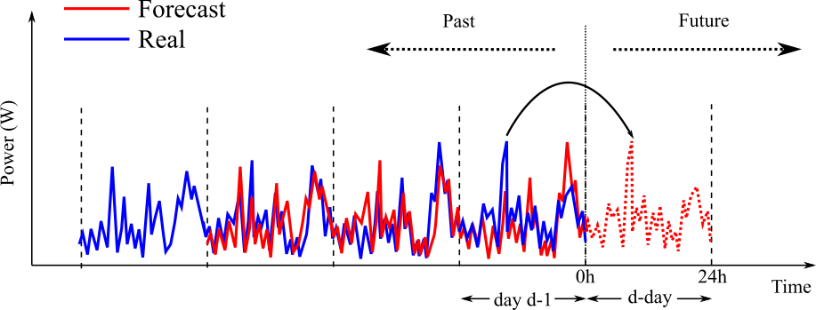
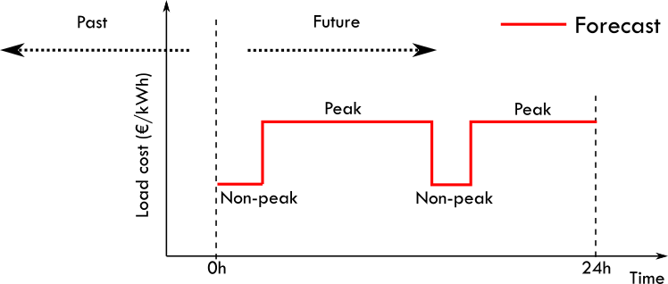

# The forecast module

EMHASS will basically need 4 forecasts to work properly:

- PV power production forecast (internally based on the weather forecast and the characteristics of your PV plant). This is given in Watts.

- Load power forecast: how much power your house will demand on the next 24h. This is given in Watts.

- Load cost forecast: the price of the energy from the grid on the next 24h. This is given in EUR/kWh.

- PV production selling price forecast: at what price are you selling your excess PV production on the next 24h. This is given in EUR/kWh.

## PV power production forecast

The default method for PV power forecast is the scrapping of weather forecast data from the https://clearoutside.com/ website. This is obtained using `method=scrapper`. This site proposes detailed forecasts based on Lat/Lon locations. This method seems quite stable but as with any scrape method it will fail if any changes are made to the webpage API.

This may change in the future to direct API's of weather forecast models as GFS or ECMWF, see:

- GFS: https://github.com/jagoosw/getgfs

- ECMWF: https://pypi.org/project/ecmwf-api-client/

A second method uses the SolCast solar forecast service. Go to https://solcast.com/ and configure your system. You will need to set `method=solcast` and basically use two parameters `solcast_rooftop_id` and `solcast_api_key` that should be passed as parameters at runtime.

For example:
```
curl -i -H 'Content-Type:application/json' -X POST -d '{"solcast_rooftop_id":"<your_system_id>","solcast_api_key":"<your_secret_api_key>"}' http://localhost:5000/action/dayahead-optim
```

A third method uses the Solar.Forecast service. You will need to set `method=solar.forecast` and use just one parameter `solar_forecast_kwp` (the PV peak installed power in kW) that should be passed at runtime.

For example, for a 5 kWp installation:
```
curl -i -H 'Content-Type:application/json' -X POST -d '{"solar_forecast_kwp":5}' http://localhost:5000/action/dayahead-optim
```

## Load power forecast

The default method for load forecast is a naive method, also called persistence. This is obtained using `method=naive`. This method simply assumes that the forecast for a future period will be equal to the observed values in a past period. The past period is controlled using parameter `delta_forecast` and the default value for this is 24h.

This is presented graphically here:



## Load cost forecast

The default method for load cost forecast is defined for a peak and non-peak hours contract type. This is obtained using `method=hp_hc_periods`.

When using this method you can provide a list of peak-hour periods, so you can add as many peak-hour periods as possible.

As an example for a two peak-hour periods contract you will need to define the following list in the configuration file:

    - list_hp_periods:
        - period_hp_1:
            - start: '02:54'
            - end: '15:24'
        - period_hp_2:
            - start: '17:24'
            - end: '20:24'
    - load_cost_hp: 0.1907
    - load_cost_hc: 0.1419

This example is presented graphically here:



## PV production selling price forecast

The default method for this forecast is simply a constant value. This can be obtained using `method=constant`.

Then you will need to define the `prod_sell_price` variable to provide the correct price for energy injected to the grid from excedent PV production in €/kWh.

## Passing your own forecast data

For all the needed forecasts in EMHASS two other methods allows the user to provide their own forecast value. This may be used to provide a forecast provided by a more powerful and accurate forecaster. The two methods are: `csv` and `list`.

For the `csv` method you should push a csv file to the `data` folder. The CSV file should contain no header and the timestamped data should have the following format:
    
    2021-04-29 00:00:00+00:00,287.07
    2021-04-29 00:30:00+00:00,274.27
    2021-04-29 01:00:00+00:00,243.38
    ...

For the list method you just have to add the data as a list of values to a data dictionnary during the call to `emhass` using the `runtimeparams` option.

The possible dictionnary keys to pass data are:

- `pv_power_forecast` for the PV power production forecast.

- `load_power_forecast` for the Load power forecast.

- `load_cost_forecast` for the Load cost forecast.

- `prod_price_forecast` for the PV production selling price forecast.

For example if using the add-on or the standalone docker installation you can pass this data as list of values to the data dictionnary during the `curl` POST:
```
curl -i -H "Content-Type: application/json" -X POST -d '{"pv_power_forecast":[0, 0, 0, 0, 0, 0, 0, 0, 0, 0, 0, 0, 0, 0, 0, 0, 70, 141.22, 246.18, 513.5, 753.27, 1049.89, 1797.93, 1697.3, 3078.93, 1164.33, 1046.68, 1559.1, 2091.26, 1556.76, 1166.73, 1516.63, 1391.13, 1720.13, 820.75, 804.41, 251.63, 79.25, 0, 0, 0, 0, 0, 0, 0, 0, 0, 0]}' http://localhost:5000/action/dayahead-optim
```

You need to be careful here to send the correct amount of data on this list, the correct length. For example, if the data time step is defined to 1h and you are performing a day-ahead optimization, then this list length should be of 24 data points.

### Example using: SolCast forecast + Amber prices

If you're using SolCast then you can define the following sensors in your system:

```
sensors:

  - platform: rest
    name: "Solcast Forecast Data"
    json_attributes:
      - forecasts
    resource: https://api.solcast.com.au/rooftop_sites/yyyy/forecasts?format=json&api_key=xxx&hours=24
    method: GET
    value_template: "{{ (value_json.forecasts[0].pv_estimate)|round(2) }}"
    unit_of_measurement: "kW"
    device_class: power
    scan_interval: 8000
    force_update: true

  - platform: template
    sensors:
      solcast_24hrs_forecast :
        value_template: >-
          
          
          
           
            
           {{ (values_all.all)[:48] }}
```

With this you can now feed this SolCast forecast to EMHASS along with the mapping of the Amber prices. 

A MPC call may look like this for 4 deferrable loads:

```
    post_mpc_optim_solcast: "curl -i -H \"Content-Type: application/json\" -X POST -d '{\"load_cost_forecast\":{{(
          ([states('sensor.amber_general_price')|float(0)] +
          state_attr('sensor.amber_general_forecast', 'forecasts') |map(attribute='per_kwh')|list)[:48])
          }}, \"prod_price_forecast\":{{(
          ([states('sensor.amber_feed_in_price')|float(0)] +
          state_attr('sensor.amber_feed_in_forecast', 'forecasts')|map(attribute='per_kwh')|list)[:48]) 
          }}, \"pv_power_forecast\":{{states('sensor.solcast_24hrs_forecast')
          }}, \"prediction_horizon\":48,\"soc_init\":{{(states('sensor.powerwall_charge')|float(0))/100
          }},\"soc_final\":0.05,\"def_total_hours\":[2,0,0,0]}' http://localhost:5000/action/naive-mpc-optim"
```

Thanks to [@purcell_labs](https://github.com/purcell-lab) for this example donfiguration.

### Example combining multiple SolCast configurations

If you have multiple rooftops, for example for east-west facing solar panels, then you will need to fuze the sensors providing the different forecasts on a single one using templates in Home Assistant. Then feed that single sensor data passing the data as a list when calling the shell command.

Here is a sample configuration to achiee this, thanks to [@gieljnssns](https://github.com/gieljnssns) for sharing.

The two sensors using rest sensors:

```
- platform: rest
  name: "Solcast Forecast huis"
  json_attributes:
    - forecasts
  resource: https://api.solcast.com.au/rooftop_sites/xxxxxxxxxxc/forecasts?format=json&api_key=xxxxxxxxx&hours=24
  method: GET
  value_template: "{{ (value_json.forecasts[0].pv_estimate)|round(2) }}"
  unit_of_measurement: "kW"
  device_class: power
  scan_interval: 86400
  force_update: true

- platform: rest
  name: "Solcast Forecast garage"
  json_attributes:
    - forecasts
  resource: https://api.solcast.com.au/rooftop_sites/xxxxxxxxxxc/forecasts?format=json&api_key=xxxxxxxxx&hours=24
  method: GET
  value_template: "{{ (value_json.forecasts[0].pv_estimate)|round(2) }}"
  unit_of_measurement: "kW"
  device_class: power
  scan_interval: 86400
  force_update: true
```

Then two templates, one for each sensor:

```
    solcast_24hrs_forecast_garage:
      value_template: >-
        
        
        
          
          
         {{ (values_all.all)[:48] }}

    solcast_24hrs_forecast_huis:
      value_template: >-
        
        
        
          
          
         {{ (values_all.all)[:48] }}
```

And the fusion of the two sensors:

```
    solcast_24hrs_forecast:
      value_template: >-
        
        
        
        
          
        
        {{ ns.items }}
```

And finally the shell command:

```
dayahead_optim: curl -i -H 'Content-Type:application/json' -X POST -d '{"pv_power_forecast":{{states('sensor.solcast_24hrs_forecast')}}}' http://localhost:5001/action/dayahead-optim
```

## Now/current values in forecasts

When implementing MPC applications with high optimization frequencies it can be interesting if at each MPC iteration the forecast values are updated with the real now/current values measured from live data. This is useful to improve the accuracy of the short-term forecasts. As shown in some of the references below, mixing with a persistance model make sense since this type of model performs very good at low temporal resolutions (intra-hour).

A simple integration of current/now values for PV and load forecast is implemented using a mixed one-observation presistence model and the one-step-ahead forecasted values from the current passed method. 

This can be represented by the following equation at time $t=k$: 

$$
P^{mix}_{PV} = \alpha \hat{P}_{PV}(k) + \beta P_{PV}(k-1)
$$

Where $P^{mix}_{PV}$ is the mixed power forecast for PV prodduction, $\hat{P}_{PV}(k)$ is the current first element of the original forecast data, $P_{PV}(k-1)$ is the now/current value of PV production and $\alpha$ and $\beta$ are coefficients that can be fixed to reflect desired dominance of now/current values over the original forecast data or viceversa.

The `alpha` and `beta` values can be passed in the dictionnary using the `runtimeparams` option during the call to `emhass`. If not passed they will both take the default 0.5 value. These values should be fixed following your own analysis on how much weight you want to put on measured values to be used as the persistance forecast. This will also depend on your fixed optimization time step. As a default they will be at 0.5, but if you want to give more weight to measured persistance values, then you can try lower $\alpha$ and rising $\beta$, for example: `alpha=0.25`, `beta=0.75`. After this you will need to check with the recored history if these values fits your needs.

## References

- E. Lorenz, J. Kuhnert, A. Hammer, D. Heinemann, Photovoltaic (PV) power predictions with PV measurements, satellite data and numerical weather predictions. Presented at CM2E, Energy & Environment
Symposium, Martinique, 2014.

- Maimouna Diagne, Mathieu David, Philippe Lauret, John Boland, NicolasSchmutz, Review of solar irradiance forecasting methods and a proposition for small-scale insular grids. Renewable and Sustainable Energy Reviews 27 (2013) 65–76.

- Bryan Lima, Sercan O. Arik, Nicolas Loeff, Tomas Pfister, Temporal Fusion Transformers for Interpretable Multi-horizon Time Series Forecasting. arXiv:1912.09363v3 [stat.ML] 27 Sep 2020.
