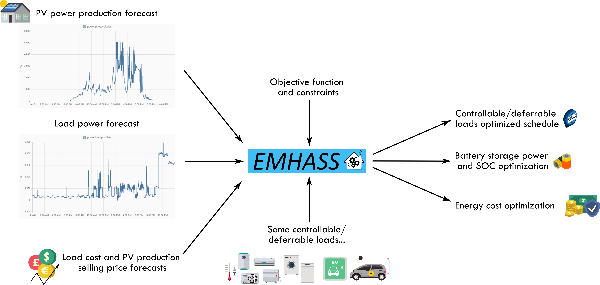
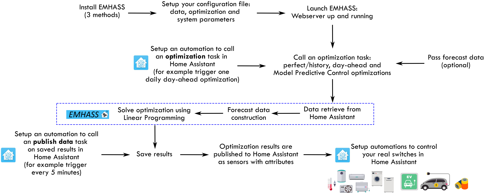

<!-- # EMHASS: Energy Management for Home Assistant

```{image} images/emhass_logo.png

```

Welcome to the documentation of EMHASS. With this package written in Python, you will be able to implement a real Energy Management System for your household. This software was designed to be easily configurable and with a fast integration with Home Assistant: <https://www.home-assistant.io/>

To get started go ahead and look at the installation procedure and usage instructions below.

```{toctree}
:caption: 'Contents:'
:maxdepth: 2

intro.md
publish_data.md
passing_data.md
differences.md
lpems.md
forecasts.md
mlforecaster.md
mlregressor.md
thermal_model.md
thermal_battery.md
study_case.md
config.md
emhass.md
develop.md
```

# Indices and tables

- {ref}`genindex`
- {ref}`modindex`
- {ref}`search` -->

<!-- **Proposed Sections (Top Navigation):**

* **🏠 Home:** The new landing page.
* **🚀 Getting Started:** Installation context and a quick study case.
* *Files:* `intro.md`, `differences.md`, `study_case.md`

* **⚙️ Configuration:** How to configure and run it.
* *Files:* `config.md`, `passing_data.md`, `publish_data.md`

* **🧠 Core Concepts:** How the optimization and forecasting works.
* *Files:* `lpems.md`, `forecasts.md`, `mlforecaster.md`, `mlregressor.md`

* **🔥 Thermal Integration:** Specifics on thermal models.
* *Files:* `thermal_model.md`, `thermal_battery.md`

* **💻 Reference:** API and Development.
* *Files:* `emhass.md`, `develop.md` -->

# <h1 align="center">Energy Management for Home Assistant</h1>

<p align="center">
  <a style="text-decoration:none" href="https://pypi.org/project/emhass/">
    
  </a>
  <a style="text-decoration:none" href="https://anaconda.org/channels/davidusb/packages/emhass/overview">
    
  </a>
  <a style="text-decoration:none" href="https://github.com/davidusb-geek/emhass/actions">
    
  </a>
  <a style="text-decoration:none" href="https://github.com/davidusb-geek/emhass/blob/master/LICENSE">
    
  </a>
  <a style="text-decoration:none" href="https://pypi.org/project/emhass/">
    
  </a>
  <a style="text-decoration:none" href="https://pypi.org/project/emhass/">
    
  </a>
  <a style="text-decoration:none" href="https://emhass.readthedocs.io/en/latest/">
    
  </a>
    <a hstyle="text-decoration:none" ref="https://codecov.io/github/davidusb-geek/emhass" >
    
  </a>
  <a hstyle="text-decoration:none" ref="https://github.com/davidusb-geek/emhass/actions/workflows/codeql.yml" >
    
  </a>
  <a style="text-decoration:none" href="https://sonarcloud.io/summary/new_code?id=davidusb-geek_emhass">
    
  </a>
  <a style="text-decoration:none" href="https://sonarcloud.io/summary/new_code?id=davidusb-geek_emhass">
    
  </a>
  <a style="text-decoration:none" href="https://sonarcloud.io/summary/new_code?id=davidusb-geek_emhass">
    
  </a>
  <a style="text-decoration:none" href="https://sonarcloud.io/summary/new_code?id=davidusb-geek_emhass">
    
  </a>
</p>

:::{container} text-center mb-3

<h3>Optimize your home energy usage automatically</h3>

EMHASS is a Python module designed to optimize your home energy interfacing with Home Assistant.

[🚀 Quick Start](section_getting_started) · [⚙️ Configuration](section_config) · [💻 API Reference](section_reference)

[🗣️ Community](https://community.home-assistant.io/t/emhass-an-energy-management-for-home-assistant/338126) · [🛠️ Issues](https://github.com/davidusb-geek/emhass/issues) · [🧩 Home Assistant Add-on](https://github.com/davidusb-geek/emhass-add-on)
:::

<br>

::::{grid} 1 2 2 3
:gutter: 2

:::{grid-item-card} 💰 **Cost Optimization**
:link: lpems
:link-type: doc

Save money by scheduling loads during low-cost tariff periods or high PV production windows using Linear Programming.
:::

:::{grid-item-card} ☀️ **Solar Forecasting**
:link: forecasts
:link-type: doc

Integrate PV forecasts to make smarter decisions about when to charge your battery or run heavy appliances.
:::

:::{grid-item-card} 🤖 **Machine Learning**
:link: mlforecaster
:link-type: doc

Advanced load forecasting using scikit-learn models to predict your household's future consumption behavior.
:::

:::{grid-item-card} 🔥 **Thermal Models**
:link: thermal_model
:link-type: doc

Manage thermal inertia for water heaters and heat pumps effectively to act as thermal energy storage.
:::

:::{grid-item-card} 🔌 **Home Assistant**
:link: intro.html#configuration-and-installation
:link-type: url

Seamless integration. Retrieve sensor data directly from Home Assistant and publish optimized schedules back.
:::

:::{grid-item-card} 🐳 **Docker & Add-on**
:link: intro.html#installation-methods
:link-type: url

Run easily as a Home Assistant Add-on or a standalone Docker container.
:::

::::

:::{container} text-center mb-3

<h3>Quick overview of EMHASS</h3>
:::



:::{container} text-center mb-3

<h3>The EMHASS workflow</h3>
:::



```{toctree}
:hidden: true

section_getting_started
section_config
section_core
section_thermal
section_reference

```
