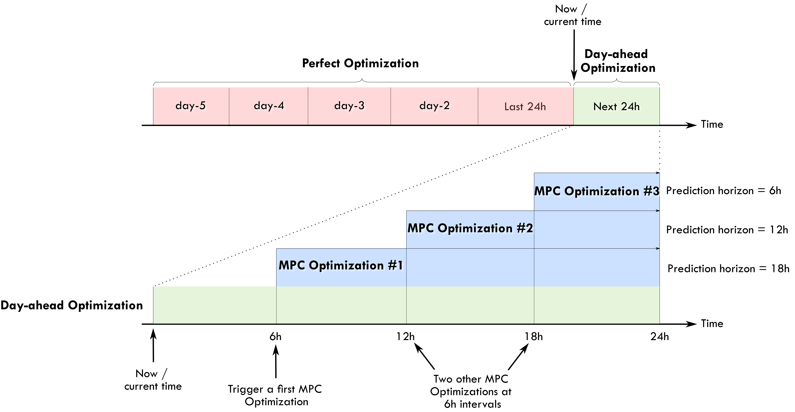

# An EMS based on Linear Programming

In this section we present the basics of the Linear Programming (LP) approach for a household Energy Management System (EMS).

## Motivation

Imagine that we have installed some solar panels in our house. Imagine that we have Home Assistant and that we can control (on/off) some crucial power consumptions in our home. For example the water heater, the pool pump, a dispatchable dishwasher, and so on. We can also imagine that we have installed a battery like a PowerWall, in order to maximize the PV self-consumption. With Home Assistant we also have sensors that can measure the power produced by our PV plant, the global power consumption of the house and hopefully the power consumed by the controllable loads. Home Assistant has released the Energy Dashboard where we can viusalize all these variables in somme really good looking graphics. See: [https://www.home-assistant.io/blog/2021/08/04/home-energy-management/](https://www.home-assistant.io/blog/2021/08/04/home-energy-management/)

Now, how can we be certain of the good and optimal management of these devices? If we define a fixed schedule for our deferrable loads, is this the best solution? When we can indicate or force a charge or discharge on the battery? This is a well known academic problem for an Energy Management System.

The first and most basic approach could be to define some basic rules or heuristics, this is the so called rule-based approach. The rules could be some fixed schedules for the deferrable loads, or some threshold based triggering of the battery charge/discharge, and so on. The rule-based approach has the advantage of being simple to implement and robust. However, the main disadvantage is that optimality is not guaranteed. 

The goal of this work is to provide an easy to implement framework where anyone using Home Assistant can apply the best and optimal set of instructions to control the energy flow in a household. There are many ways and techniques that can be found in the literature to implement optimized EMS. In this package we are using just one of those techniques, the Linear Programming approach, that will be presented below.

When I was designing and testing this package in my own house I estimated a daily gain between 5% and 8% when using the optimized approach versus a rule-based one. In my house I have a 5 kWp PV installation with a contractual grid supply of 9 kVA. I have a grid contract with two tariffs for power consumption for the grid (peak and non-peak hours) and one tariff for the excess PV energy injected to the grid. I have no battery installed, but I suppose that the margin of gain would be even bigger with a battery, adding flexibility to the energy management. Of course the disadvantage is the initial capital cost of the battery stack. In my case the gain comes from the fact that the EMS is helping me to decide when to turn on my water heater and the pool pump. If we have a good clear sky day the results of the optimization will normally be to turn them on during the day where solar production is present. But if the day is going to be really clouded, then is possible that the best solution will be to turn them on during the non-peak tariff hours, for my case this is during the night from 9pm to 2am. All these decisions are made automatically by the EMS using forecasts of both the PV production and the house power consumption.

Some other good packages and projects offer similar approaches to EMHASS. I can cite for example the good work done by my friends at the G2ELab in Grenoble, France. They have implemented the OMEGAlpes package that can also be used as an optimized EMS using LP and MILP (see: [https://gricad-gitlab.univ-grenoble-alpes.fr/omegalpes/omegalpes](https://gricad-gitlab.univ-grenoble-alpes.fr/omegalpes/omegalpes)). But here in EMHASS the first goal was to keep it simple to implement using configuration files and the second goal was that it should be easy to integrate to Home Assistant. I am sure that there will be a lot of room for optimize the code and the package implementation as this solution will be used and tested in the future.

I have included a list of scientific references at the bottom if you want to deep into the technical aspects of this subject.

Ok, let's start by a resumed presentation of the LP approach.

## Linear programming

Linear programming is an optimization method that can be used to obtain the best solution from a given cost function using a linear modeling of a problem. Typically we can also also add linear constraints to the optimization problem.

This can be mathematically written as:

$$
  & \underset{x}{\text{Maximize  }} && \mathbf{c}^\mathrm{T} \mathbf{x}\\
  & \text{subject to  } && A \mathbf{x} \leq \mathbf{b} \\
  & \text{and  } && \mathbf{x} \ge \mathbf{0}
$$

with $\mathbf{x}$  the variable vector that we want to find, $\mathbf{c}$ and $\mathbf{b}$ are vectors with known coefficients and $\mathbf{A}$ is a matrix with known values. Here the cost function is defined by $\mathbf{c}^\mathrm{T} \mathbf{x}$. The inequalities $A \mathbf{x} \leq \mathbf{b}$ and $\mathbf{x} \ge \mathbf{0}$ represent the convex region of feasible solutions. 

We could find a mix of real and integer variables in $\mathbf{x}$, in this case the problem is referred as Mixed Integer Linear Programming (MILP). Typically this kind of problem use the branch and boud type of solvers or similars.

The LP has of course its set of advantages and disadvantages. The main advantage is the that if the problem is well posed and the region of feasible possible solutions is convex, then a solution is guaranteed and solving times are usually fast when compared to other optimization techniques (as dynamic programming for example). However we can easily fall into memory issues, larger solving times and convergence problems if the size of the problem is too high (too many equations).

## Household EMS with LP

The LP problem for the household EMS is solved in EMHASS using different user-chosen cost functions.

Three main cost functions are proposed.

### Cost functions

#### **1/ The _profit_ cost function:** 

In this case the cost function is posed to maximize the profit. The profit is defined by the revenues from selling PV power to the grid minus the cost of consumed energy from the grid. 
This can be represented with the following objective function:

$$
\sum_{i=1}^{\Delta_{opt}/\Delta_t} -0.001*\Delta_t*(unit_{LoadCost}[i]*P_{gridPos}[i] + prod_{SellPrice}*P_{gridNeg}[i])
$$

> For the special case of an energy contract where the totality of the PV produced energy is injected into the grid this will be:
> 
> $$
> \sum_{i=1}^{\Delta_{opt}/\Delta_t} -0.001*\Delta_t*(unit_{LoadCost}[i]*(P_{load}[i]+P_{defSum}[i]) + prod_{SellPrice}*P_{gridNeg}[i])
> $$

where $\Delta_{opt}$ is the total period of optimization in hours, $\Delta_t$ is the optimization time step in hours, $unit_{LoadCost_i}$ is the cost of the energy from the utility in EUR/kWh, $P_{load}$ is the electricity load consumption (positive defined), $P_{defSum}$ is the sum of the deferrable loads defined, $prod_{SellPrice}$ is the price of the energy sold to the utility, $P_{gridNeg}$ is the negative component of the grid power, this is the power exported to the grid. All these power are expressed in Watts.

#### **2/ The energy from the grid _cost_:** 

In this case the cost function is computed as the cost of the energy coming from the grid. The PV power injected into the grid is not valorized.
This is:

$$
\sum_{i=1}^{\Delta_{opt}/\Delta_t} -0.001*\Delta_t*unit_{LoadCost}[i]*P_{gridPos}[i]
$$

> Again, for the special case of an energy contract where the totality of the PV produced energy is injected into the grid this will be:
> 
> $$
> \sum_{i=1}^{\Delta_{opt}/\Delta_t} -0.001*\Delta_t* unit_{LoadCost}[i]*(P_{load}[i]+P_{defSum}[i])
> $$

#### **3/ The _self-consumption_ cost function:**

This is a cost function designed to maximize the self-consumption of the PV plant. 
> [!NOTE]
> EMHASS has two methods for defining a self-consumption cost function: **bigm** and **maxmin**. In the current version, only the **bigm** method is used, as the maxmin method has convergence issues.

##### **bigM self-consumption method**
In this case, the cost function is based on the profit cost function, but the energy offtake cost is weighted more heavily than the energy injection revenue. 
This can be represented with the following objective function:

$$
\sum_{i=1}^{\Delta_{opt}/\Delta_t} -0.001*\Delta_t*(bigM*unit_{LoadCost}[i]*P_{gridPos}[i] + prod_{SellPrice}*P_{gridNeg}[i])
$$

where bigM equals 1000.
Adding this bigM factor will give more weight to the cost of grid offtake, or formulated differently: avoiding offtake through self-consumption will have strong influence on the calculated cost.

Please note that the bigM factor is not used in the calculated cost that comes out of the optimizer results. It is only used to drive the optimizer.

> ##### **Maxmin self-consumption method** (currently disabled)
>
> The cost function is computed as the revenues from selling PV power to the grid, plus the avoided cost of consuming PV power locally (the latter means: valorizing the self-consumed cost at the grid offtake price).
>
> The self-consumption is defined as:
> 
> $$
> SC = \min(P_{PV}, (P_{load}+P_{defSum}))
> $$
> 
> To convert this to a linear cost function, an additional continuous variable $SC$ is added. This is the so-called maximin problem.
> The cost function is defined as:
> 
> $$
> \sum_{i=1}^{\Delta_{opt}/\Delta_t} SC[i]
> $$
> 
> With the following set of constraints:
> 
> $$
> SC[i] \leq P_{PV}[i]
> $$
> 
> and
> 
> $$
> SC[i] \leq P_{load}[i]+P_{defSum}[i]
> $$

All these cost functions can be chosen by the user with the `--costfun` tag with the `emhass` command. The options are: `profit`, `cost`, `self-consumption`.
They are all set in the LP formulation as cost function to maximize.

The problem constraints are written as follows.

### The main constraint: power balance

$$
P_{PV_i}-P_{defSum_i}-P_{load_i}+P_{gridNeg_i}+P_{gridPos_i}+P_{stoPos_i}+P_{stoNeg_i}=0
$$

with $P_{PV}$ the PV power production, $P_{gridPos}$ the positive component of the grid power (from grid to household), $P_{stoPos}$ and $P_{stoNeg}$ are the positive (discharge) and negative components of the battery power (charge).

Normally the PV power production and the electricity load consumption are considered known. In the case of a day-ahead optimization these should be forecasted values. When the optimization problem is solved the others power defining the power flow are found as a result: the deferrable load power, the grid power and the battery power.

### Other constraints

Some other special linear constraints are defined. A constraint is introduced to avoid injecting and consuming from grid at the same time, which is physically impossible. Other constraints are used to control the total time that a deferrable load will stay on and the number of start-ups. 

Constraints are also used to define semi-continuous variables. Semi-continuous variables are variables that must take a value between their minimum and maximum or zero.

A final set of constraints is used to define the behavior of the battery. Notably:
- Ensure that maximum charge and discharge powers are not exceeded.
- Minimum and maximum state of charge values are not exceeded.
- Force the final state of charge value to be equal to the initial state of charge.

The minimum and maximum state of charge limitations can be expressed as follows:

$$
\sum_{i=1}^{k} \frac{P_{stoPos_i}}{\eta_{dis}} + \eta_{ch}P_{stoNeg_i} \leq \frac{E_{nom}}{\Delta_t}(SOC_{init}-SOC_{min})
$$

and

$$
-(\sum_{i=1}^{k} \frac{P_{stoPos_i}}{\eta_{dis}} + \eta_{ch}P_{stoNeg_i}) \leq \frac{E_{nom}}{\Delta_t}(SOC_{max}-SOC_{init})
$$

where $E_{nom}$ is the battery capacity in kWh, $\eta_{dis/ch}$ are the discharge and charge efficiencies and $SOC$ is the state of charge.

Forcing the final state of charge value to be equal to the initial state of charge can be expressed as follows:

$$
\sum_{i=1}^{k} \frac{P_{stoPos_i}}{\eta_{dis}} + \eta_{ch}P_{stoNeg_i} = \frac{E_{nom}}{\Delta_t}(SOC_{init}-SOC_{final})
$$

## The EMHASS optimizations

There are 3 different optimization types that are implemented in EMHASS.

- A perfect forecast optimization.

- A day-ahead optimization.

- A Model Predictive Control optimization.

The following example diagram may help us understand the time frames of these optimizations:

### Perfect forecast optimization

This is the first type of optimization task that are proposed with this package. In this case the main inputs, the PV power production and the house power consumption, are fixed using historical values from the past. This mean that in some way we are optimizing a system with a perfect knowledge of the future. This optimization is of course non-practical in real life. However this can be give us the best possible solution of the optimization problem that can be later used as a reference for comparison purposes. On the example diagram presented before, the perfect optimization is defined on a 5-day period. These historical values will be retrieved from the Home Assistant database.

### Day-ahead optimization

In this second type of optimization task the PV power production and the house power consumption are forecasted values. This is the action that should be performed in a real case scenario and is the case that should be launched from Home Assistant to obtain an optimized energy management of future actions. This optimization is defined in the time frame of the next 24 hours.

As the optimization is bounded to forecasted values, it will also be bounded to uncertainty. The quality and accuracy of the optimization results will be inevitably linked to the quality of the forecast used for these values. The better the forecast error, the better accuracy of the optimization result.

### Model Predictive Control (MPC) optimization

This is an informal/naive representation of a MPC controller. 

This type of controller performs the following actions:

- Set the prediction horizon and receding horizon parameters.
- Perform an optimization on the prediction horizon.
- Apply the first element of the obtained optimized control variables.
- Repeat at a relatively high frequency, ex: 5 min.

On the example diagram presented before, the MPC is performed on 6h intervals at 6h, 12h and 18h. The prediction horizon is progressively reducing during the day to keep the one-day energy optimization notion (it should not just be a fixed rolling window as, for example, you would like to know when you want to reach the desired `soc_final`). This type of optimization is used to take advantage of actualized forecast values during throughout the day. The user can of course choose higher/lower implementation intervals, keeping in mind the contraints below on the `prediction_horizon`.

When applying this controller, the following `runtimeparams` should be defined:

- `prediction_horizon` for the MPC prediction horizon. Fix this at at least 5 times the optimization time step.

- `soc_init` for the initial value of the battery SOC for the current iteration of the MPC. 

- `soc_final` for the final value of the battery SOC for the current iteration of the MPC. 

- `def_total_hours` for the list of deferrable loads functioning hours. These values can decrease as the day advances to take into account receding horizon daily energy objectives for each deferrable load.

In a practical use case, the values for `soc_init` and `soc_final` for each MPC optimization can be taken from the initial day-ahead optimization performed at the beginning of each day.

We are now ready to configure our system using the proposed configuration file and link our package to Home Assistant!

## References

- Camille Pajot, Lou Morriet, Sacha Hodencq, Vincent Reinbold, Benoit Delinchant, Frédéric Wurtz, Yves Maréchal, Omegalpes: An Optimization Modeler as an EfficientTool for Design and Operation for City Energy Stakeholders and Decision Makers, BS'15, Building Simulation Conference, Roma in September 24, 2019.

- Gabriele Comodi, Andrea Giantomassi, Marco Severini, Stefano Squartini, Francesco Ferracuti, Alessandro Fonti, Davide Nardi Cesarini, Matteo Morodo,
and Fabio Polonara. Multi-apartment residential microgrid with electrical and thermal storage devices: Experimental analysis and simulation of energy management strategies. Applied Energy, 137:854–866, January 2015.

- Pedro P. Vergara, Juan Camilo López, Luiz C.P. da Silva, and Marcos J. Rider. Security-constrained optimal energy management system for threephase
residential microgrids. Electric Power Systems Research, 146:371–382, May 2017.

- R. Bourbon, S.U. Ngueveu, X. Roboam, B. Sareni, C. Turpin, and D. Hernandez-Torres. Energy management optimization of a smart wind power plant comparing heuristic and linear programming methods. Mathematics and Computers in Simulation, 158:418–431, April 2019.
