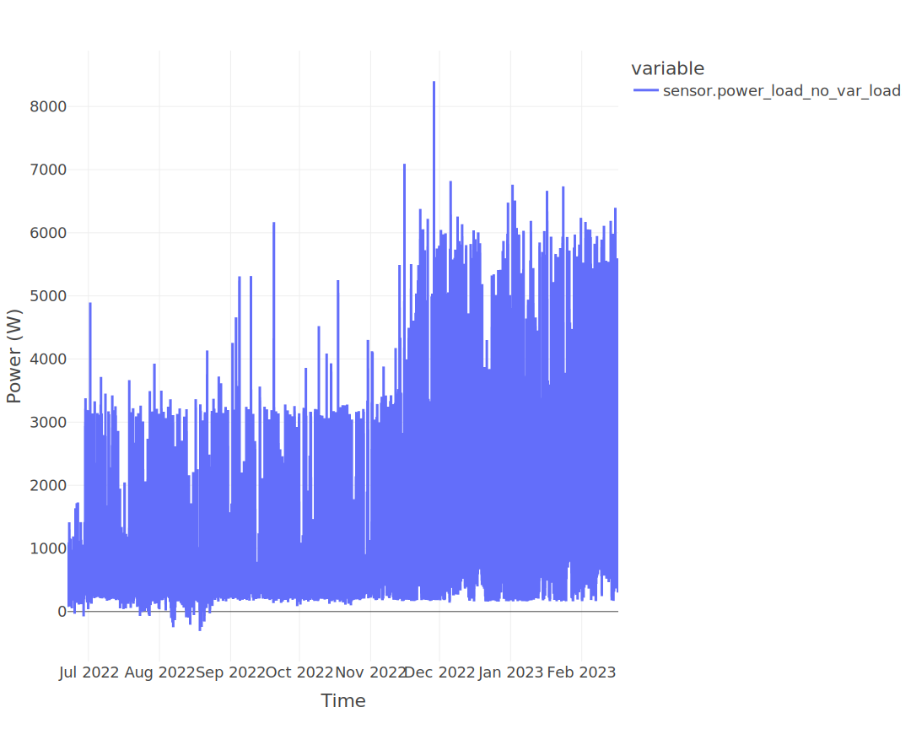
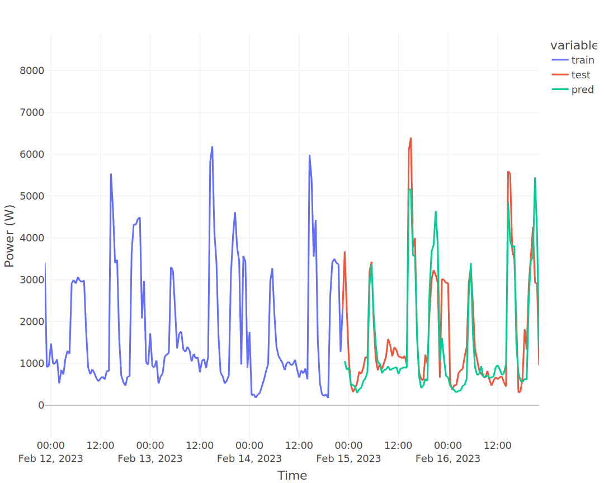
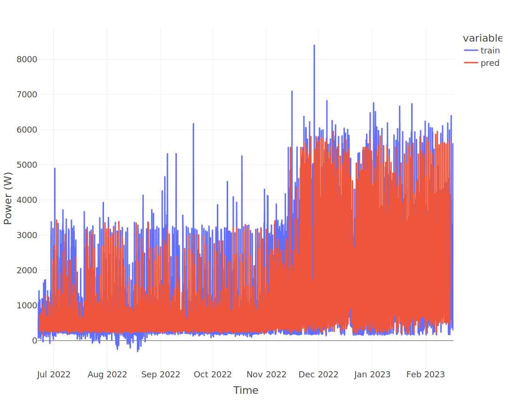
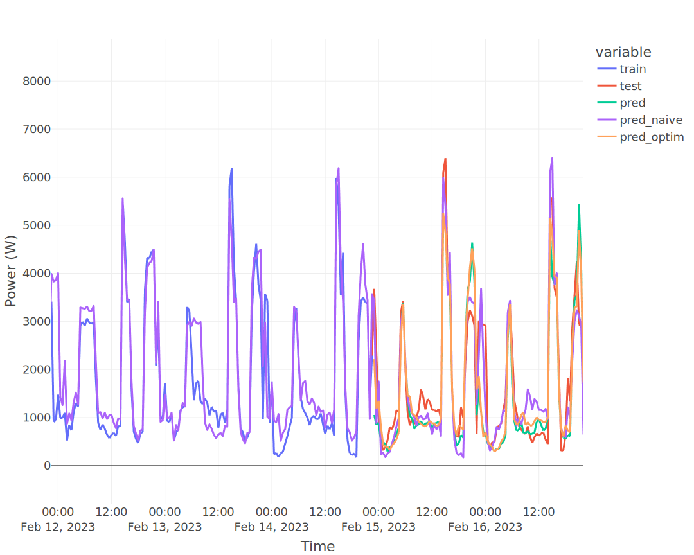

# The machine learning forecaster

Starting with v0.4.0, a new forecast framework is proposed within EMHASS. It provides a more efficient way to forecast the power load consumption. It is based on the `skforecast` module that uses `scikit-learn` regression models considering auto-regression lags as features. The hyperparameter optimization is proposed using bayesian optimization from the `optuna` module.

This API provides three main methods:

- fit: to train a model with the passed data. This method is exposed with the `forecast-model-fit` end point.

- predict: to obtain a forecast from a pre-trained model. This method is exposed with the `forecast-model-predict` end point.

- tune: to optimize the models hyperparameters using bayesian optimization. This method is exposed with the `forecast-model-tune` end point.

## A basic model fit

To train a model use the `forecast-model-fit` end point. 

Some paramters can be optionally defined at runtime:

- `days_to_retrieve`: the total days to retrieve from Home Assistant for model training. Defined this in order to retrieve as much history data as possible.

- `model_type`: define the type of model forecast that this will be used for. For example: `load_forecast`. This should be an unique name is you are using multiple custom forecast models.

- `var_model`: the name of the sensor to retrieve data from Home Assistant. Example: `sensor.power_load_no_var_loads`.

- `sklearn_model`: the `scikit-learn` model that will be used. For now only this options are possible: `LinearRegression`, `ElasticNet` and `KNeighborsRegressor`.

- `num_lags`: the number of auto-regression lags to consider. A good starting point is to fix this as one day. For example if your time step is 30 minutes, then fix this to 48, if the time step is 1 hour the fix this to 24 and so on.

- `split_date_delta`: the delta from now to `split_date_delta` that will be used as the test period to evaluate the model.

- `perform_backtest`: if `True` then a back testing routine is performed to evaluate the performance of the model on the complete train set.

The default values for these parameters are:
```
runtimeparams = {
    "days_to_retrieve": 30,
    "model_type": "load_forecast",
    "var_model": "sensor.power_load_no_var_loads",
    "sklearn_model": "KNeighborsRegressor",
    "num_lags": 48,
    "split_date_delta": '48h',
    "perform_backtest": False
}
```

A correct `curl` call to launch a model fit can look like this:
```
curl -i -H "Content-Type:application/json" -X POST -d '{}' http://localhost:5000/action/forecast-model-fit
```

As an example, the following figure show a 240 days load power data retrieved from EMHASS and that will be used for a model fit:



After applying the `curl` command to fit the model the following information is logged by EMHASS:

    2023-02-20 22:05:22,658 - __main__ - INFO - Training a KNN regressor
    2023-02-20 22:05:23,882 - __main__ - INFO - Elapsed time: 1.2236599922180176
    2023-02-20 22:05:24,612 - __main__ - INFO - Prediction R2 score: 0.2654560762747957

As we can see the $R^2$ score for the fitted model on the 2 day test perdiod is $0.27$.
A quick prediction graph using the fitted model should be available in the webui:



Visually the prediction look quite acceptable but we need to evaluate this further. For this we can use the `"perform_backtest": True` option to perform a backtest evaluation using this syntax:
```
curl -i -H "Content-Type:application/json" -X POST -d '{"perform_backtest": True}' http://localhost:5000/action/forecast-model-fit
```

The results of the backtest will be shown in the logs:

    2023-02-20 22:05:36,825 - __main__ - INFO - Simple backtesting
    2023-02-20 22:06:32,162 - __main__ - INFO - Backtest R2 score: 0.5851552394233677

So the mean backtest metric of our model is $R^2=0.59$. 

Here is the grpahic result of the backtesting routine:



## The predict method

To obtain a prediction using a previously trained model use the `forecast-model-predict` end point. 
```
curl -i -H "Content-Type:application/json" -X POST -d '{}' http://localhost:5000/action/forecast-model-predict
```
If needed pass the correct `model_type` like this:
```
curl -i -H "Content-Type:application/json" -X POST -d '{"model_type": "load_forecast"}' http://localhost:5000/action/forecast-model-predict
```
The resulting forecast DataFrame is shown in the webui.

## The tuning method with Bayesian hyperparameter optimization

With a previously fitted model you can use the `forecast-model-tune` end point to tune its hyperparameters. This will be using bayeasian optimization with a wrapper of `optuna` in the `skforecast` module.

The syntax will be:
```
curl -i -H "Content-Type:application/json" -X POST -d '{}' http://localhost:5000/action/forecast-model-tune
```
This will launch the optimization routine and optimize the internal hyperparamters of the `scikit-learn` regressor and it will find the optimal number of lags.
The following are the logs with the results obtained after the optimization for a KNN regressor:

    2023-02-20 22:06:43,112 - __main__ - INFO - Backtesting and bayesian hyperparameter optimization
    2023-02-20 22:25:29,987 - __main__ - INFO - Elapsed time: 1126.868682384491
    2023-02-20 22:25:50,264 - __main__ - INFO - ### Train/Test R2 score comparison ###
    2023-02-20 22:25:50,282 - __main__ - INFO - R2 score for naive prediction in train period (backtest): 0.22525145245617462
    2023-02-20 22:25:50,284 - __main__ - INFO - R2 score for optimized prediction in train period: 0.7485208725102304
    2023-02-20 22:25:50,312 - __main__ - INFO - R2 score for non-optimized prediction in test period: 0.7098996657492629
    2023-02-20 22:25:50,337 - __main__ - INFO - R2 score for naive persistance forecast in test period: 0.8714987509894714
    2023-02-20 22:25:50,352 - __main__ - INFO - R2 score for optimized prediction in test period: 0.7572325833767719

This is a graph comparing these results:



The naive persistance load forecast model performs very well on the 2 day test period with a $R^2=0.87$, however is well out-performed by the KNN regressor when back-testing on the complete training set (10 months of 30 minute time step data) with a score $R^2=0.23$.

The hyperparameter tuning using bayesian optimization improves the bare KNN regressor from $R^2=0.59$ to $R^2=0.75$. The optimized number of lags is $48$.

```{warning} 

The tuning routine can be computing intense. If you have problems with computation times, try to reduce the `days_to_retrieve` paramter. In the example shown, for a 240 days train period, the optimization routine took almost 20 min to finish on a amd64 architecture machine. This is a task that should be performed once in a while, for example every week.
```
