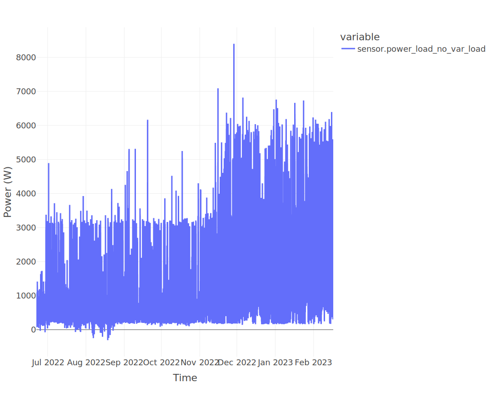
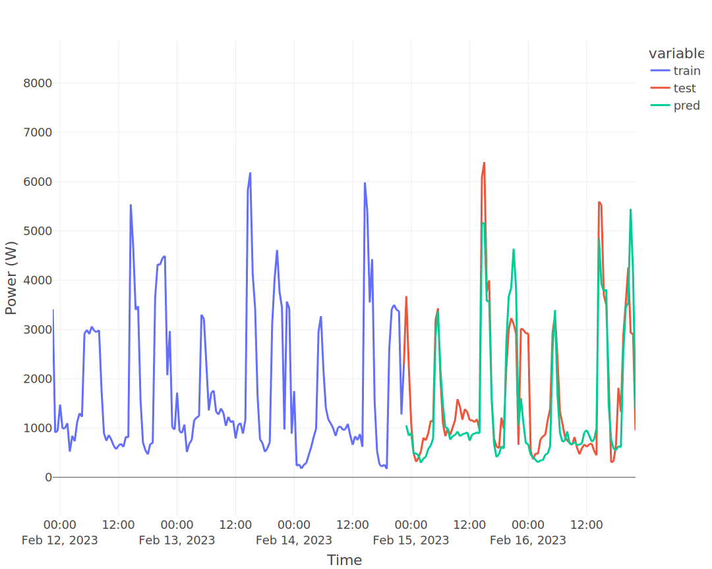
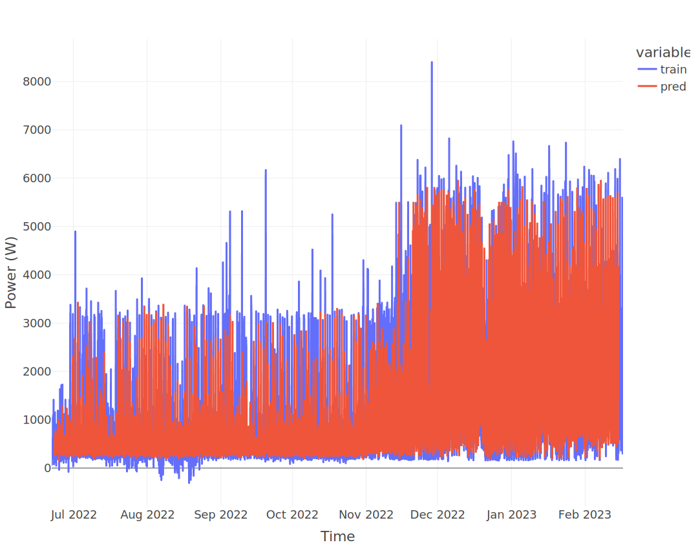
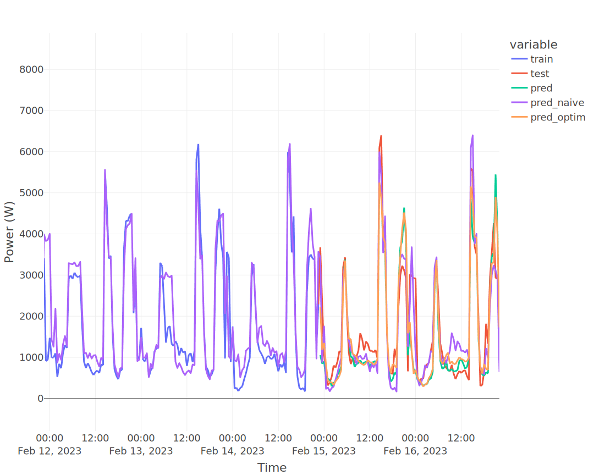

# The machine learning forecaster

Starting with v0.4.0, a new forecast framework is proposed within EMHASS. It provides a more efficient way to forecast the power load consumption. It is based on the `skforecast` module that uses `scikit-learn` regression models considering auto-regression lags as features. The hyperparameter optimization is proposed using Bayesian optimization from the `optuna` module.

This API provides three main methods:

- fit: to train a model with the passed data. This method is exposed with the `forecast-model-fit` endpoint.

- predict: to obtain a forecast from a pre-trained model. This method is exposed with the `forecast-model-predict` endpoint.

- tune: to optimize the model's hyperparameters using Bayesian optimization. This method is exposed with the `forecast-model-tune` endpoint.

## A basic model fit

To train a model use the `forecast-model-fit` end point. 

Some parameters can be optionally defined at runtime:

- `historic_days_to_retrieve`: the total days to retrieve from Home Assistant for model training. Define this to retrieve as much history data as possible.

```{note}
The minimum number of `historic_days_to_retrieve` is hard coded to 9 by default. However, it is advised to provide more data for better accuracy by modifying your Home Assistant recorder settings. 
```

- `model_type`: define the type of model forecast that this will be used for. For example: `load_forecast`. This should be a unique name if you are using multiple custom forecast models.

- `var_model`: the name of the sensor to retrieve data from Home Assistant. Example: `sensor.power_load_no_var_loads`.

- `sklearn_model`: the `scikit-learn` model that will be used. These options are possible: `LinearRegression`, `RidgeRegression`, `LassoRegression`, `ElasticNet`, `KNeighborsRegressor`, `DecisionTreeRegressor`, `SVR`, `RandomForestRegressor`, `ExtraTreesRegressor`, `GradientBoostingRegressor`, `AdaBoostRegressor`, `MLPRegressor`.

- `num_lags`: the number of auto-regression lags to consider. A good starting point is to fix this at one day. For example, if your time step is 30 minutes, then fix this to 48, if the time step is 1 hour fix this to 24 and so on.

- `split_date_delta`: the delta from now to `split_date_delta` that will be used as the test period to evaluate the model.

- `perform_backtest`: if `True` then a backtesting routine is performed to evaluate the performance of the model on the complete train set.

- `mlforecaster_weather_features`: an optional list of weather covariate columns to feed the model as exogenous inputs, in addition to the always-present calendar features. See [Adding weather covariates](#adding-weather-covariates) below. Leave empty (the default) to keep the historical date-features-only behaviour.

The default values for these parameters are:
```python
runtimeparams = {
    'historic_days_to_retrieve': 9,
    "model_type": "long_train_data",
    "var_model": "sensor.power_load_no_var_loads",
    "sklearn_model": "KNeighborsRegressor",
    "num_lags": 48,
    "split_date_delta": '48h',
    "perform_backtest": False,
    "mlforecaster_weather_features": []
}
```

A correct `curl` call to launch a model fit can look like this:
```bash
curl -i -H "Content-Type:application/json" -X POST -d '{}' http://localhost:5000/action/forecast-model-fit
```

As an example, the following figure shows 240 days of load power data retrieved from EMHASS that will be used for a model fit:



After applying the `curl` command to fit the model the following information is logged by EMHASS:

    2023-02-20 22:05:22,658 - __main__ - INFO - Training a KNN regressor
    2023-02-20 22:05:23,882 - __main__ - INFO - Elapsed time: 1.2236599922180176
    2023-02-20 22:05:24,612 - __main__ - INFO - Prediction R2 score: 0.2654560762747957

As we can see the $R^2$ score for the fitted model on the 2-day test period is $0.27$.
A quick prediction graph using the fitted model should be available in the web UI:



Visually the prediction looks quite acceptable but we need to evaluate this further. For this, we can use the `"perform_backtest": True` option to perform a backtest evaluation using this syntax:
```
curl -i -H "Content-Type:application/json" -X POST -d '{"perform_backtest": "True"}' http://localhost:5000/action/forecast-model-fit
```

The results of the backtest will be shown in the logs:

    2023-02-20 22:05:36,825 - __main__ - INFO - Simple backtesting
    2023-02-20 22:06:32,162 - __main__ - INFO - Backtest R2 score: 0.5851552394233677
    2023-02-20 22:06:32,163 - __main__ - INFO - Backtest metrics — MAE: 142.3456, RMSE: 198.2345, R2: 0.5852, MAPE: 12.34%

So the mean backtest metric of our model is $R^2=0.59$. 

Here is the graphic result of the backtesting routine:



### Backtest goodness-of-fit metrics

When `perform_backtest=True` the fitted `MLForecaster` object exposes a `backtest_metrics_` attribute — a dict with the following keys computed over the out-of-sample backtest folds:

| Key | Metric |
| --- | --- |
| `mae` | Mean Absolute Error (same unit as the target sensor, e.g. W) |
| `rmse` | Root Mean Squared Error (same unit) |
| `r2` | Coefficient of determination $R^2$ (dimensionless, higher is better) |
| `mape` | Mean Absolute Percentage Error (%; rows where the actual value is zero are excluded) |
| `n_samples` | Number of backtest steps used to compute the metrics |

All four metrics are also printed to the log at INFO level after the backtest completes, making it easy to compare model variants or assess the effect of adding weather covariates.

`backtest_metrics_` is `None` before `fit()` is called and when `perform_backtest=False` (the default).

## Adding weather covariates

By default the forecaster only uses calendar features derived from the timestamps (hour, day of week, month, etc.). For loads that are weather-dependent — a heat pump being the canonical example — you can additionally feed the model selected weather columns as *exogenous* inputs. Because the weather forecast is known over the optimization horizon, these are valid "future known covariates" for the recursive model, exactly like the calendar features.

This is opt-in and backward-compatible: leave `mlforecaster_weather_features` empty (the default) and the model behaves exactly as before.

Enable it by listing the columns you want, for example the outside temperature plus a heating/cooling-degree thermal-demand signal:
```bash
curl -i -H "Content-Type:application/json" -X POST \
  -d '{"mlforecaster_weather_features": ["temp_air", "heating_degree", "cooling_degree"]}' \
  http://localhost:5000/action/forecast-model-fit
```

The same `mlforecaster_weather_features` value should be set for the fit, tune and predict actions (most easily by configuring it once in the EMHASS config rather than per-call), so that the model is trained and used with a consistent feature set.

The supported values are sourced from the Open-Meteo weather forecast:

| Feature | Meaning |
| --- | --- |
| `temp_air` | Air temperature at 2 m (°C) |
| `relative_humidity` | Relative humidity (%) |
| `cloud_cover` | Total cloud cover (%) |
| `wind_speed` | Wind speed at 10 m |
| `ghi` | Global horizontal irradiance (shortwave radiation) |
| `direct_radiation` | Direct radiation |
| `diffuse_radiation` | Diffuse radiation |
| `precipitation` | Precipitation |
| `heating_degree` | `max(0, comfort − temp_air)` — a forecastable heating-demand signal |
| `cooling_degree` | `max(0, temp_air − comfort)` — a forecastable cooling-demand signal |

`heating_degree`/`cooling_degree` are derived locally from the retrieved temperature using an 18 °C comfort set-point, so they are available even if you do not request `temp_air` itself.

```{note}
**Weather covariates always come from Open-Meteo, regardless of your `weather_forecast_method`.**

EMHASS supports several methods for the PV *production* forecast (Solcast, Forecast.Solar, the built-in clear-sky model, etc.), but none of those services expose raw meteorological variables such as outside temperature, humidity, cloud cover or precipitation — they only publish a predicted power or irradiance curve. The weather covariates needed here are those raw atmospheric quantities, and Open-Meteo is the only source already integrated into EMHASS that provides them at the required resolution.

For this reason, when `mlforecaster_weather_features` is non-empty, EMHASS will *always* make a separate Open-Meteo request to fetch the covariate data, irrespective of how you have configured `weather_forecast_method`. Your PV forecast method is not affected and does not need to change.

No extra API key or configuration is required: Open-Meteo is free and open access, and EMHASS reuses its existing Open-Meteo cache file so the additional network overhead is minimal. The historical weather needed to train the model is fetched from Open-Meteo's recent past window (up to 92 days), so this works without you having to record a weather sensor in Home Assistant.
```

```{note}
A weather covariate only helps if the load actually responds to it. On a heat-pump-dominated home, adding `temp_air` + `heating_degree`/`cooling_degree` measurably reduces the load forecast error; on a weather-insensitive load it will add little. Use `perform_backtest` to verify the gain on your own data before committing to it.
```

### Benchmark results

The table below summarises a **paired 20-fold rolling-origin backtest** (24 h / 288-step horizon, 5-minute resolution) on a heat-pump-influenced home load, comparing each model's load MAE with and without the `temp_air` + `heating_degree`/`cooling_degree` covariate set:

| Model | AR lags | Covariates | Load MAE (W) | Change vs. baseline | Folds improved |
| --- | ---: | --- | ---: | ---: | ---: |
| Lasso | 864 | ✓ | ~380 | −10.5% | 15/20 |
| Lasso | 864 | ✗ (baseline) | ~425 | — | — |
| skforecast-LightGBM | 288 | ✓ | ~490 | −7.9% | 12/20 |
| skforecast-LightGBM | 288 | ✗ (baseline) | ~535 | — | — |
| KNN | 288 | ✓ | ~620 | ~0% | — |
| KNN | 288 | ✗ (baseline) | ~620 | — | — |
| RandomForest | 288 | not benched (recursive-288 cost prohibitive) | — | — | — |

Key takeaways:

- **Lasso wins the most**: a linear model generalises the 3 scalar temperature signals well over 864 autoregressive lags; the weather gain is clear and consistent (15/20 folds).
- **KNN is unaffected**: with 288 AR lags already in the feature space, 3 extra temperature scalars are drowned out — no measurable gain.
- **Architecture matters more than covariates**: a Darts-based direct multi-output forecaster (not recursive) achieves ~410 W MAE on the same dataset vs. ~536 W for the best recursive skforecast model, showing that the recursion error accumulation over a 24 h horizon dominates the covariate benefit. Weather covariates are still a worthwhile addition to the recursive models available in the `mlforecaster`, but further error reduction at longer horizons may require a direct-output architecture.

These results are load-dependent; gains will vary with how weather-sensitive your load is. Use `perform_backtest` to measure the improvement on your own data before committing to a covariate set.

## The predict method

To obtain a prediction using a previously trained model use the `forecast-model-predict` endpoint. 
```
curl -i -H "Content-Type:application/json" -X POST -d '{}' http://localhost:5000/action/forecast-model-predict
```
If needed pass the correct `model_type` like this:
```bash
curl -i -H "Content-Type:application/json" -X POST -d '{"model_type": "long_train_data"}' http://localhost:5000/action/forecast-model-predict
```
The resulting forecast DataFrame is shown in the web UI.

It is possible to publish the predict method results to a Home Assistant sensor. By default, this is deactivated but it can be activated by using runtime parameters.

The list of parameters needed to set the data publish task is:

- `model_predict_publish`: set to `True` to activate the publish action when calling the `forecast-model-predict` endpoint.

- `model_predict_entity_id`: the unique `entity_id` to be used.

- `model_predict_unit_of_measurement`: the `unit_of_measurement` to be used.

- `model_predict_friendly_name`: the `friendly_name` to be used.

The default values for these parameters are:
```python
runtimeparams = {
    "model_predict_publish": False,
    "model_predict_entity_id": "sensor.p_load_forecast_custom_model",
    "model_predict_unit_of_measurement": "W",
    "model_predict_friendly_name": "Load Power Forecast custom ML model"
}
```

## The tuning method with Bayesian hyperparameter optimization

With a previously fitted model, you can use the `forecast-model-tune` endpoint to tune its hyperparameters. This will be using Bayesian optimization with a wrapper of `optuna` in the `skforecast` module.

You can pass the same parameter you defined during the fit step, but `var_model` has to be defined at least. According to the example, the syntax will be:
```bash
curl -i -H "Content-Type:application/json" -X POST -d '{"var_model": "sensor.power_load_no_var_loads"}' http://localhost:5000/action/forecast-model-tune
```
It is possible to pass the `n_trials` parameter to define the number of trials to perform during the optimization.
The default value for this parameter is:
```python
runtimeparams = {
    "n_trials": 10
}
```
This will launch the optimization routine and optimize the internal hyperparameters of the `scikit-learn` regressor and it will find the optimal number of lags.
The following are the logs with the results obtained after the optimization for a KNN regressor:

    2023-02-20 22:06:43,112 - __main__ - INFO - Backtesting and bayesian hyperparameter optimization
    2023-02-20 22:25:29,987 - __main__ - INFO - Elapsed time: 1126.868682384491
    2023-02-20 22:25:50,264 - __main__ - INFO - ### Train/Test R2 score comparison ###
    2023-02-20 22:25:50,282 - __main__ - INFO - R2 score for naive prediction in train period (backtest): 0.22525145245617462
    2023-02-20 22:25:50,284 - __main__ - INFO - R2 score for optimized prediction in train period: 0.7485208725102304
    2023-02-20 22:25:50,312 - __main__ - INFO - R2 score for non-optimized prediction in test period: 0.7098996657492629
    2023-02-20 22:25:50,337 - __main__ - INFO - R2 score for naive persistence forecast in test period: 0.8714987509894714
    2023-02-20 22:25:50,352 - __main__ - INFO - R2 score for optimized prediction in test period: 0.7572325833767719

This is a graph comparing these results:



The naive persistence load forecast model performs very well on the 2-day test period with a $R^2=0.87$, however is well out-performed by the KNN regressor when back-testing on the complete training set (10 months of 30-minute time step data) with a score $R^2=0.23$.

The hyperparameter tuning using Bayesian optimization improves the bare KNN regressor from $R^2=0.59$ to $R^2=0.75$. The optimized number of lags is $48$.

```{warning} 

The tuning routine can be computing intense. If you have problems with computation times, try to reduce the `historic_days_to_retrieve` parameter. In the example shown, for a 240-day train period, the optimization routine took almost 20 min to finish on an amd64 Linux architecture machine with an i5 processor and 8 GB of RAM. This is a task that should be performed once in a while, for example, every week.
```

## How does this work? 
This machine learning forecast class is based on the `skforecast` module. 
We use the recursive autoregressive forecaster with added features. 

I will borrow this image from the `skforecast` [documentation](https://skforecast.org/0.11.0/user_guides/autoregresive-forecaster) that helps us understand the working principles of this type of model. 

 

With this type of model what we do in EMHASS is to create new features based on the timestamps of the data retrieved from Home Assistant. We create new features based on the day, the hour of the day, the day of the week, and the month of the year, among others. 

What is interesting is that these added features are based on the timestamps, they are always known in advance and useful for generating forecasts. These are the so-called future known covariates.

This can be extended with other known future covariates. As described in [Adding weather covariates](#adding-weather-covariates), you can feed forecasted weather columns (e.g. the outside temperature) to the model — these are also future known covariates because the weather forecast spans the optimization horizon. Other signals known in advance, such as a scheduled presence sensor, could be added in the same way.

## Going further?
This class can be generalized to forecast any given sensor variable present in Home Assistant. It has been tested and the main initial motivation for this development was for better load power consumption forecasting. But in reality, it has been coded flexibly so that you can control what variable is used, how many lags, the amount of data used to train the model, etc.

So you can go further and try to forecast other types of variables and possibly use the results for some interesting automations in Home Assistant. If doing this, what is important is to evaluate the pertinence of the obtained forecasts. The hope is that the tools proposed here can be used for that purpose.

## Future directions

### Probabilistic forecasting and confidence intervals

The `backtest_metrics_` attribute described above gives a useful point estimate of model quality, but it does not tell you *how much to trust a specific prediction*. Propagating forecast uncertainty through the MILP optimisation — so the solver can trade off the risk of over- and under-forecasting — would require a probabilistic model that outputs a distribution (or at least a credible interval) for each step, not a scalar.

A natural candidate is **Gaussian Process Regression** (GPR), which is the only `scikit-learn` regressor that is natively stochastic: it returns a mean prediction together with a variance estimate whose shape adapts to the local density of the training data. Wiring GPR into the `mlforecaster` as an optional `sklearn_model` choice, and plumbing its per-step standard deviation through to the MILP as a second tensor, would be the foundation for **stochastic MPC** — optimising expected cost under forecast uncertainty rather than optimising a single deterministic trajectory.

This is a non-trivial architecture change (the MILP formulation, the objective function, and the EMHASS optimisation layer would all need updating), and it is intentionally left as a future direction rather than implemented here.
