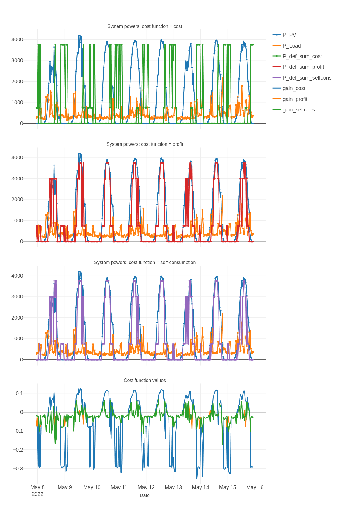
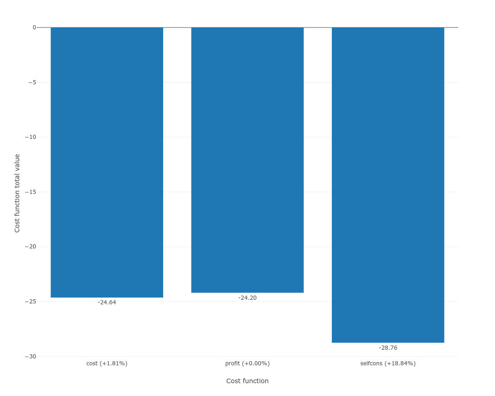

# A real study case

In this section a study case is presented.

For this example a 5 kWp solar production is considered with two deferrable loads. No battery is considered. The configuration used is the default configuration proposed with EMHASS.

We compare the results obtained with the perfect optimization using the following command:
```
emhass --action 'perfect-optim' --config '/home/user/emhass' --costfun 'profit'
```

The `--costfun` is compared with all the possible options: `profit`, `cost`, `self-consumption`.

The obtained results are presented below. These results different behaviors of the optimization algorithm depending on the cost function.



In this particular case, for comparison purposes, we compute the profit value for each cost function. The results are presented below:



We can see that for this particular case, the profit cost function is the most interesting if we focus on maximizing profit. However this can differ depending on your specific usage of your PV production. In some cases it could be interesting to maximize self-consumption, for example in off-grid applications.

The real implementation of EMHASS and its efficiency depends on the quality of the forecasted PV power production and the house load consumption.

Here is an extract of the PV power production forecast with the default PV forecast method from EMHASS: a web scarpping of the clearoutside page based on the defined lat/lon location of the system. These are the forecast results of the GFS model. 


