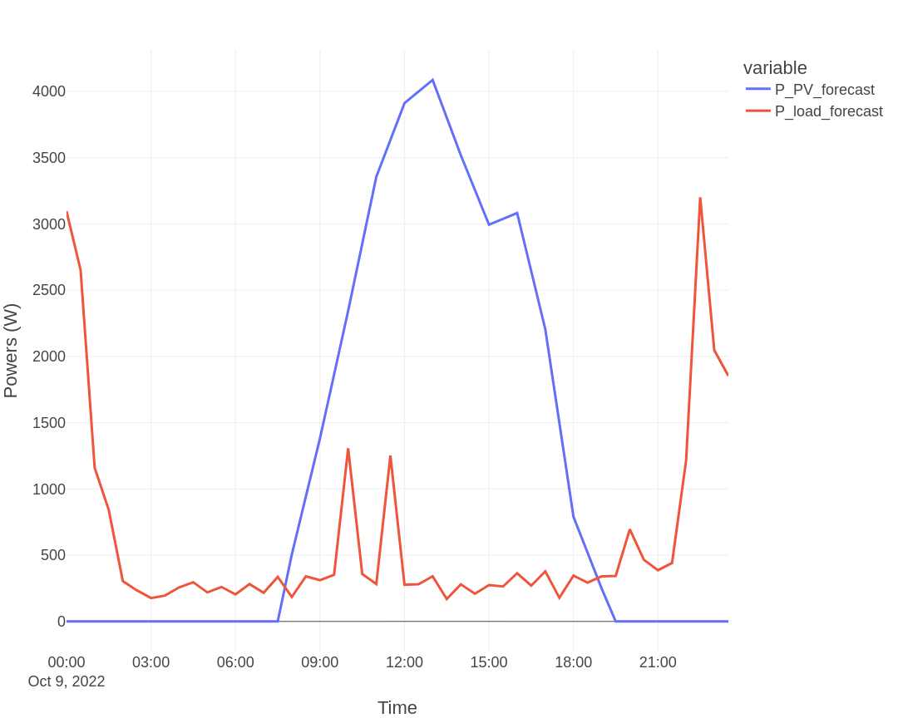
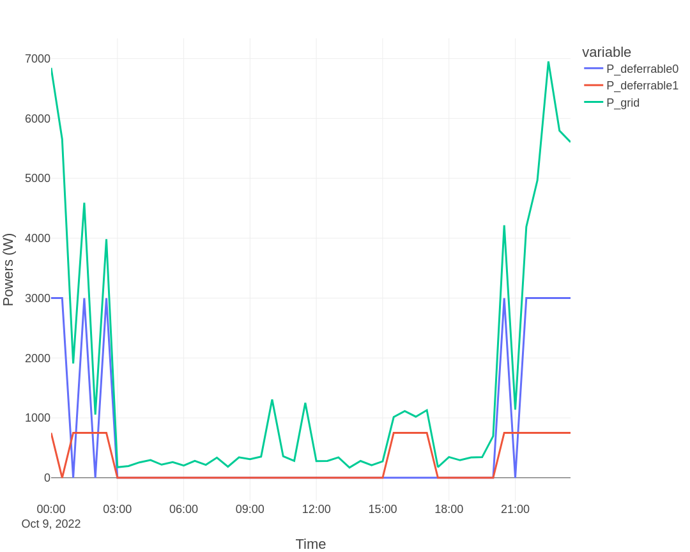

# Basic system — no PV, two deferrable loads

> **Type:** Tutorial — learning-oriented, follow step by step.

This is the simplest scenario: no PV installation, two deferrable loads (for example, a water heater and a pool pump). EMHASS schedules when to run each load to minimize cost against the day-ahead electricity price.

## System

| Component | Value |
|-----------|-------|
| PV | none (`set_use_pv: false` or `pv_forecast: [0, 0, ...]`) |
| Battery | none |
| Deferrable load 1 | water heater, 3000 W |
| Deferrable load 2 | pool pump, 750 W |
| Optimization mode | day-ahead |
| Cost function | profit |

## Configuration

If you are running the **EMHASS Add-on**, set in the Add-on configuration page:

```yaml
set_use_pv: false
nominal_power_of_deferrable_loads:
  - 3000
  - 750
operating_hours_of_each_deferrable_load:
  - 5
  - 8
```

If you are running **standalone Docker** with `config_emhass.yaml`, the same keys apply directly.

The other parameters keep the defaults from `config_defaults.json`.

## Run the optimization

REST (Add-on or Docker):

```bash
curl -i -H "Content-Type: application/json" \
     -X POST -d '{}' \
     http://localhost:5000/action/dayahead-optim
```

Or use the **Add-on action button** in the EMHASS web UI: open `http://YOUR_HA_IP:5000/`, click *"Day-ahead optimization"*.

For the legacy CLI variant, see [Legacy CLI Commands](legacy_cli.md).

## Output

The retrieved input forecasted powers:



The optimization result:



For this system, the total value of the cost function is **−5.38 EUR** (negative = cost, i.e. you pay 5.38 EUR for the day's optimized schedule). The schedule places both loads in low-price hours.

## Interpretation

- The optimizer treats both deferrable loads as fixed-energy: `load × hours = energy_to_deliver`. It is free to choose *when* in the next 24 h to run them.
- Without PV, there is no self-consumption opportunity — the only optimization lever is the time-varying load cost.
- A cost function of −5.38 EUR for a day with both loads (3 kW × 5 h + 0.75 kW × 8 h = 21 kWh) implies an average paid price of about 0.26 EUR/kWh.

## See also

- Tutorial: [Basic — PV](basic_pv.md) (same loads + 5 kWp PV)
- Reference: [Configuration](../config.md) for every parameter
- Reference: [Passing data](../passing_data.md) for runtime payload schema
- How-to: [MPC walkthrough](mpc.md) when you need rolling-horizon control instead of day-ahead
