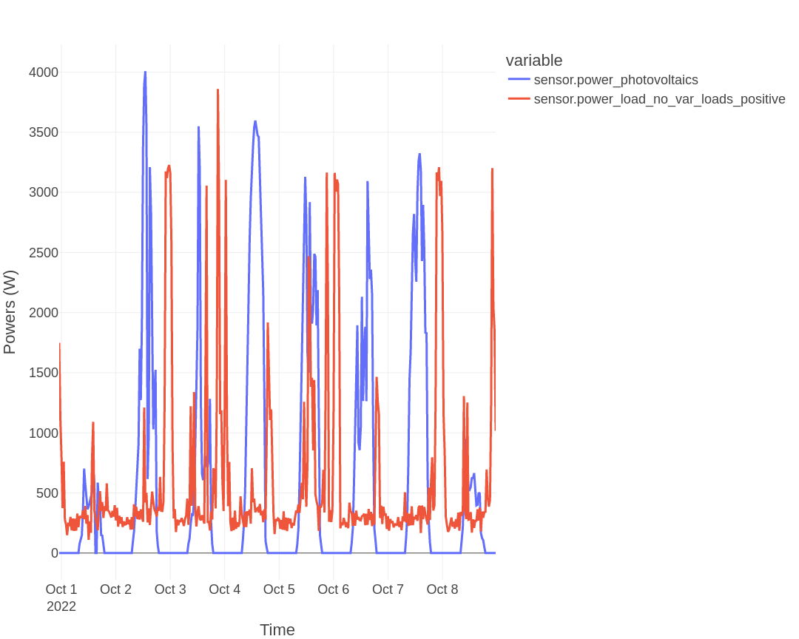
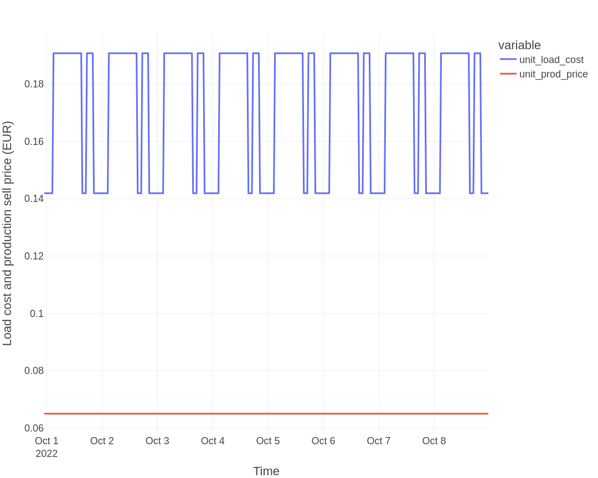
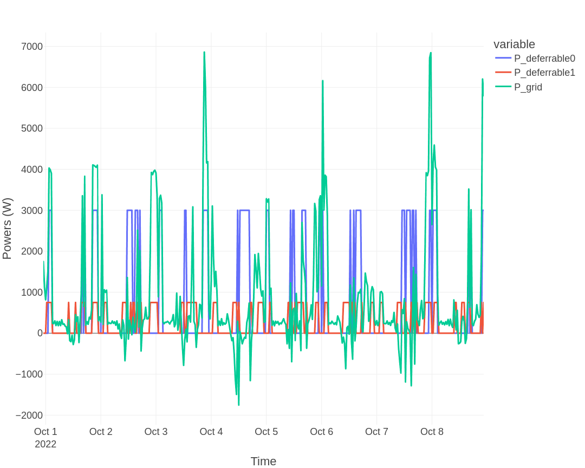
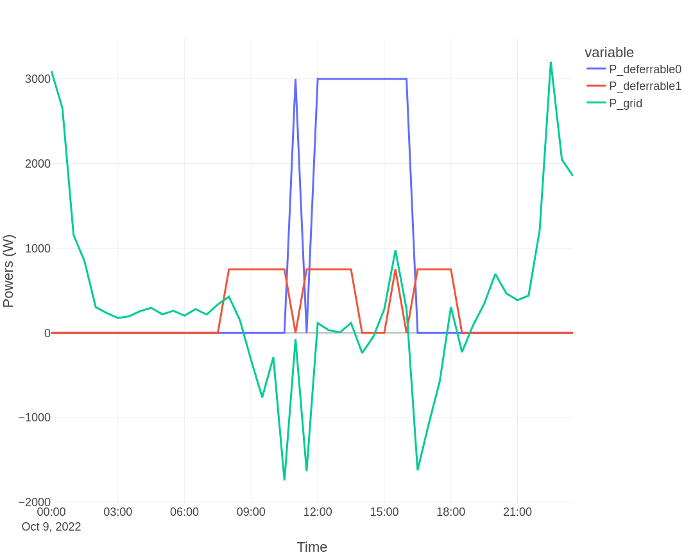

# Basic system — 5 kWp PV, two deferrable loads

> **Type:** Tutorial — learning-oriented, follow step by step.

This scenario adds a 5 kWp PV installation to the previous tutorial. No battery yet. We run two optimization modes against this system: a 7-day historical **perfect optimization** (to see what the optimal schedule would have been with hindsight) and a **day-ahead optimization** (the real production case).

## System

| Component | Value |
|-----------|-------|
| PV | 5 kWp |
| Battery | none |
| Deferrable load 1 | water heater, 3000 W |
| Deferrable load 2 | pool pump, 750 W |
| Optimization modes | perfect-optim (backtest), dayahead-optim |
| Cost function | profit |

This matches the default configuration shipped in `config_defaults.json` — no parameter changes required.

## Perfect optimization (7-day historical backtest)

The `perfect-optim` mode uses real measured PV production and load data from the last 7 days, so the optimizer has perfect knowledge of inputs. The result is the theoretical best-case cost, useful as a benchmark for what `dayahead-optim` is approaching.

Run it:

```bash
curl -i -H "Content-Type: application/json" \
     -X POST -d '{}' \
     http://localhost:5000/action/perfect-optim
```

Or the *Perfect optimization* button in the EMHASS web UI.

Inputs (real measured powers over 7 days):



Load cost and PV selling price:



Result:



Cost function over the 7-day period: **−26.23 EUR**.

## Day-ahead optimization

The `dayahead-optim` mode is the real production case: forecasted PV (from `open-meteo` by default; alternatives via `weather_forecast_method` are `solcast`, `solar.forecast`, or the `scrapper` clearoutside method), forecasted load (1-day persistence by default), forecasted prices (provided at runtime if dynamic).

Run it:

```bash
curl -i -H "Content-Type: application/json" \
     -X POST -d '{}' \
     http://localhost:5000/action/dayahead-optim
```

Result:



Cost function: **−1.56 EUR** for the next day. With `costfun: profit`, this is net cash flow over the period (positive = revenue, negative = expenditure); a less-negative value means lower net cost. Compared with the **−5.38 EUR** of the no-PV case (see [Basic — no PV](basic_no_pv.md)), the PV installation reduces the daily net spend by about 71%.

## Interpretation

- `perfect-optim` (`−26.23 EUR` over 7 days, ≈ −3.75 EUR/day) gives the theoretical best — the gap to `dayahead-optim` (`−1.56 EUR`/day) represents forecast uncertainty.
- The closer your PV-forecast and load-forecast are to reality, the more `dayahead-optim` approaches `perfect-optim`. Forecast quality is the dominant factor — see [Good Practices](good_practices.md) for details.
- Without a battery, all PV produced beyond instantaneous load is fed to grid (or curtailed if `prod_price ≤ 0`). Adding a battery typically improves cost further — see the next tutorial.

## See also

- Tutorial: [Basic — no PV](basic_no_pv.md) (same loads, no PV)
- Tutorial: [Basic — PV + Battery](basic_pv_battery.md) (this scenario plus a 5 kWh battery)
- Reference: [Forecasts](../forecasts.md) for PV/load forecast methods
- Explanation: [Good Practices](good_practices.md) for forecast-quality wisdom
