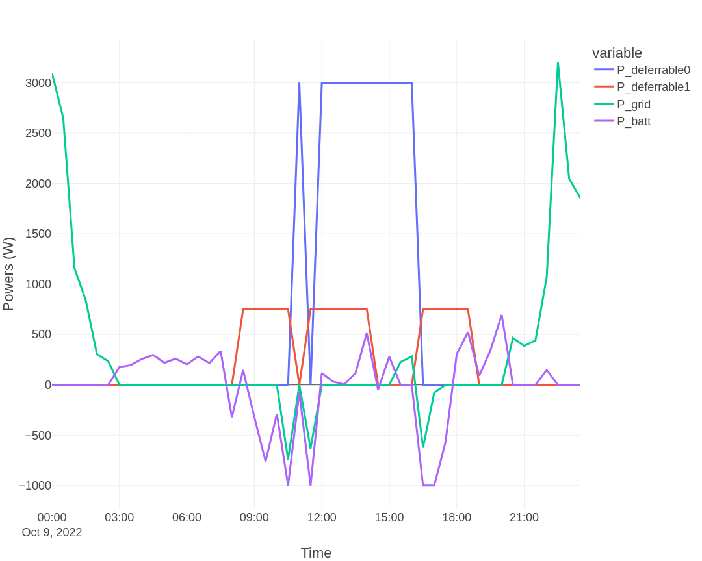
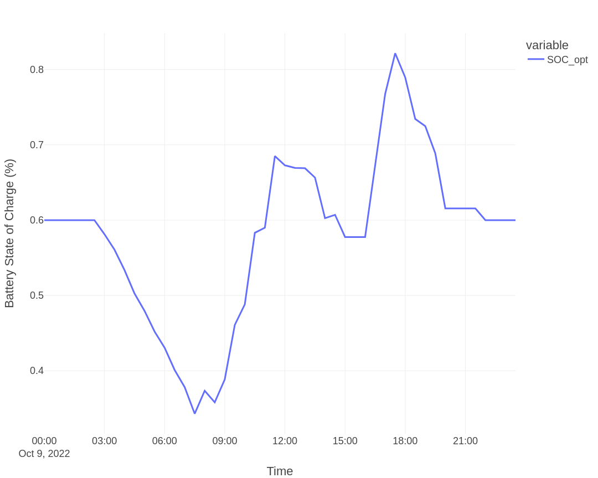

# Basic system — 5 kWp PV, 5 kWh battery, two deferrable loads

> **Type:** Tutorial — learning-oriented, follow step by step.

This scenario adds a 5 kWh battery to the previous tutorial. The optimizer now schedules battery charge/discharge alongside the deferrable loads.

## System

| Component | Value |
|-----------|-------|
| PV | 5 kWp |
| Battery | 5 kWh nominal, default charge/discharge limits |
| Deferrable load 1 | water heater, 3000 W |
| Deferrable load 2 | pool pump, 750 W |
| Optimization mode | dayahead-optim |
| Cost function | profit |

## Configuration

The only change versus [Basic — PV](basic_pv.md) is enabling the battery. In Add-on options:

```yaml
set_use_battery: true
```

If you want to override the defaults (shown below — adjust to your hardware):

```yaml
set_use_battery: true
battery_discharge_power_max: 1000      # max discharge power, W
battery_charge_power_max: 1000         # max charge power, W
battery_discharge_efficiency: 0.95
battery_charge_efficiency: 0.95
battery_nominal_energy_capacity: 5000  # Wh (= 5 kWh) — default
battery_minimum_state_of_charge: 0.3   # default
battery_maximum_state_of_charge: 0.9   # default
battery_target_state_of_charge: 0.6    # default — also used as default soc_init/soc_final when not passed at runtime
```

For the meaning of each parameter and acceptable ranges, see [Configuration](../config.md).

## Run

```bash
curl -i -H "Content-Type: application/json" \
     -X POST -d '{}' \
     http://localhost:5000/action/dayahead-optim
```

## Output

Optimization result:



Battery state of charge:



Cost function: **−1.23 EUR**, compared with **−1.56 EUR** for the same system without a battery — a further ~20% improvement.

## Interpretation

- Battery shifts surplus PV from midday into evening peak hours, avoiding grid purchase during expensive hours.
- The SOC curve typically rises during peak PV (charging) and falls during peak load + peak price (discharging).
- The improvement size is sensitive to the spread between import price and export price. Low export prices (or none) make the battery more valuable; high export prices reduce its marginal benefit.
- The `battery_target_state_of_charge` parameter is used as the default for both `soc_init` and `soc_final` when neither is passed at runtime, so the optimizer plans the battery to start and end at this fraction. For rolling-horizon control, see the [MPC walkthrough](mpc.md).

```{note}
**SOC convention.** EMHASS expresses SOC as a fraction of the **nominal** battery capacity (0.0 = empty, 1.0 = full). The configured `battery_minimum_state_of_charge` and `battery_maximum_state_of_charge` are the operational bounds the optimizer is allowed to use — they do **not** rescale the SOC fraction. A reported `SOC_opt = 0.45` means 45% of nominal capacity.
```

## See also

- Tutorial: [Basic — PV](basic_pv.md) (same system without battery)
- How-to: [MPC walkthrough](mpc.md) for rolling-horizon control with battery
- Reference: [Configuration](../config.md) for all battery parameters
- Explanation: [Good Practices](good_practices.md) — SOC semantics, forecast quality, infeasibility triage
