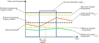

# Deferrable load thermal model

EMHASS supports defining a deferrable load as a thermal model.
This is useful to control thermal equipement as: heaters, air conditioners, etc.
The advantage of using this approach is that you will be able to define your desired room temperature jsut as you will do with your real equipmenet thermostat.
Then EMHASS will deliver the operating schedule to maintain that desired temperature while minimizing the energy bill and taking into account the forecasted outdoor temperature.

A big thanks to @werdnum for proposing this model and the initial code for implementing this.

## The thermal model

The thermal model implemented in EMHASS is a linear model represented by the following equation:

$$
    T_{in}^{pred}[k+1] = T_{in}^{pred}[k] + P_{def}[k]\frac{\alpha_h\Delta t}{P_{def}^{nom}}-(\gamma_c(T_{in}^{pred}[k] - T_{out}^{fcst}[k]))
$$

where $k$ is each time instant, $T_{in}^{pred}$ is the indoor predicted temperature, $T_{out}^{fcst}$ is the outdoor forecasted temperature and $P_{def}$ is the deferrable load power.

In this model we can see two main configuration parameters:
- The heating rate $\alpha_h$ in degrees per hour.
- The cooling constant $\gamma_c$ in degrees per hour per degree of cooling.

These parameters are defined according to the thermal characteristics of the building/house.
It was reported by @werdnum, that values of $\alpha_h=5.0$ and $\gamma_c=0.1$ were reasonable in his case. 
Of course these parameters should be adapted to each use case. This can be done with with history values of the deferrable load operation and the differents temperatures (indoor/outdoor).

The following diagram tries to represent an example behavior of this model:



## Implementing the model

To implement this model we need to provide a configuration for the discussed parameters and the input temperatures. You need to pass in the start temperature, the desired room temperature per timestep, and the forecasted outdoor temperature per timestep.

We will control this by using data passed at runtime.
The first step will be to define a new entry `def_load_config`, this will be used as a dictionary to store any needed special configuration for each deferrable load.

For example if we have just **two** deferrable loads and the **second** load is a **thermal load** then we will define `def_load_config` as for example:
```
'def_load_config': {
    {},
    {'thermal_config': {
        'heating_rate': 5.0,
        'cooling_constant': 0.1,
        'overshoot_temperature': 24.0,
        'start_temperature': 20,
        'desired_temperatures': [...]
    }}
}
```

Here the `desired_temperatures` is a list of float values for each time step.

Now we also need to define the other needed input, the `outdoor_temperature_forecast`, which is a list of float values. The list of floats for `desired_temperatures` and the list in `outdoor_temperature_forecast` should have proper lengths, if using MPC the length should be at least equal to the prediction horizon.

Here is an example modified from a working example provided by @werdnum to pass all the needed data at runtime.
This example is given for the following configuration: just one deferrable load (a thermal load), no PV, no battery, an MPC application, pre-defined heating intervals times. 

```
rest_command:
  emhass_forecast:
    url: http://localhost:5000/action/naive-mpc-optim
    method: post
    timeout: 300
    payload: >
      
        {{ (((today_at(time) - now()) / timedelta(minutes=30)) | round(0, 'ceiling')) % 48 }}
      
      
      
      {
        "prediction_horizon": {{ horizon }},
        "load_cost_forecast": {{
          (
            [states('sensor.general_price')|float(0)]
            + state_attr('sensor.electricity_price_forecast', 'forecasts')
            |map(attribute='per_kwh')
            |list
          )[:horizon]
        }},
        "pv_power_forecast": [
          
          {{ comma() }}0
        ],
        "def_load_config": {
          "thermal_config": {
            "heating_rate": 5.0,
            "cooling_constant": 0.1,
            "overshoot_temperature": 24.0,
            "start_temperature": {{ state_attr("climate.living", "current_temperature") }},
            "heater_desired_temperatures": [
              
              
                
                {{ comma() }}
                
                21
                
                0
                
              
            ]
          }
        },
        "outdoor_temperature_forecast": [
          
          
            
              {{ comma() }}{{ fc.temperature }}
              
                {{ comma() }}{{ fc.temperature }}
              
            
          
        ]
      }
```
